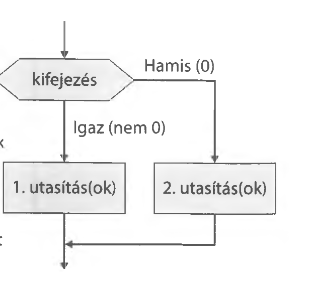
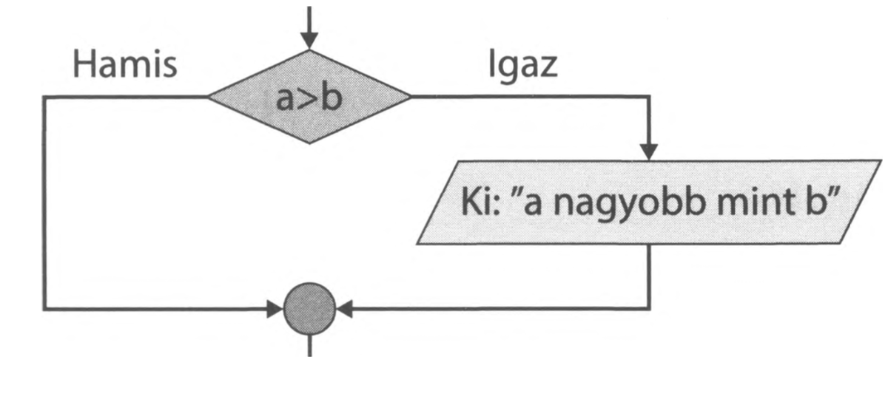
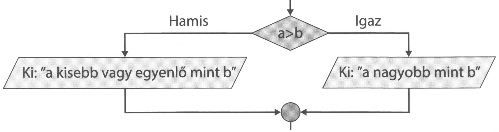

# 2.8. Elágazás

A program bizonyos részein szükség lehet arra, hogy egy adott feltételtől függően kell végrehajtani valamit. Gyakori probléma, ha a számítások során negatív szám van a gyök alatt, vagy egy tört esetén 0 van a nevezőben. Ilyenkor feltételhez kell kötni a matematikai művelet elvégzését, és csak akkor végezni el, ha az lehetséges.

Magyarul a feltételes mondatot HA-val kezdjük. Ennek megfelelően C#-ban az angol `if` utasítás szükséges, majd zárójelben a logikai kifejezés, amely egy relációs művelet. A kifejezés értéke igaz, vagy hamis lehet.

{ width="600" }

Az összehasonlító művelet eredménye tehát `bool` típus lehet, amely a C# logikai típusa, és értéke `true` (igaz), vagy `false` (hamis) lehet.

**Relációs műveletek:**

| Művelet | Jelentés |
| :--- | :--- |
| `a > b` | a nagyobb, mint b |
| `a >= b` | a nagyobb vagy egyenlő, mint b |
| `a < b` | a kisebb, mint b |
| `a <= b` | a kisebb vagy egyenlő, mint b |
| `a == b` | a egyenlő b-vel |
| `a != b` | a nem egyenlő b-vel |

*(Az `a` és `b` változó, vagy kifejezés lehet.)*

A feltételes utasításnak 2 alapvető alkalmazása van és C#-ban ez így valósul meg:

### 1. Csak "Igaz" ág
Ha a feltétel igaz, akkor csináljunk valamit. A folyamatábra részletről jól látható, hogy a feltétel hamis ágán nincs utasítás, így azt elhagyhatjuk.

```csharp
if (a > b)
{
    Console.WriteLine("a nagyobb mint b");
}
```

{ width="500" }

### 2. "Igaz" és "Hamis" ág
Ha a feltétel igaz, akkor csináljunk valamit, ha hamis, akkor valami mást. A folyamatábra részletből megállapítható, hogy a feltétel igaz és hamis ágán is van utasítás így azt egyértelműen meg kell adni a programozási nyelven is.

```csharp
if (a > b)
{
    Console.WriteLine("a nagyobb mint b");
}
else
{
    Console.WriteLine("a kisebb, vagy egyenlő mint b");
}
```

{ width="500" }

---

!!! example "9. feladat"
    Kérjünk be egy egész számot a billentyűzetről, és ha a szám nagyobb mint 0, akkor írjuk ki a képernyőre, hogy "A szám pozitív"! Név: Feltételes1.

**Megoldás:**
```csharp
static void Main(string[] args)
{
    int a = 0;
    Console.Write("Kérek egy számot: ");
    a = Convert.ToInt32(Console.ReadLine());
    
    if (a > 0)
    {
        Console.WriteLine("A szám pozitív");
    }
    Console.ReadKey();
}
```

!!! tip "Zárójelek elhagyása"
    Megjegyzés: Ha a logikai kifejezés után csak 1 utasítás áll, akkor a `{}` zárójelek elhagyhatók. 
    Pl.: `if (a > 0) Console.WriteLine("A szám pozitív");`

Láthatjuk azonban, hogy ez a program semmit nem csinál, ha a bekért szám nem pozitív. Ha arra az esetre is van tennivaló, amikor a logikai kifejezés hamis, akkor azt az `else` után kell megadni. Ilyen eset fordul elő a másodfokú egyenletek gyökeinek kiszámításánál, ha a megoldóképletben a diszkrimináns értéke negatív. A következő példa ezt mutatja be.

!!! example "10. feladat"
    Kérjünk be a másodfokú egyenlet együtthatóit és számítsuk ki a gyököket 2 tizedes pontossággal! Ha a diszkrimináns negatív, írjuk ki a képernyőre: "Nincs megoldás"! Név: Másodfokú.

**Megoldás:**
```csharp
static void Main(string[] args)
{
    double a = 0, b = 0, c = 0, d = 0, x1 = 0, x2 = 0;
    
    Console.WriteLine("Másodfokú egyenlet gyökeinek számítása:");
    Console.WriteLine();
    
    Console.Write("a = ");
    a = Convert.ToDouble(Console.ReadLine());
    Console.Write("b = ");
    b = Convert.ToDouble(Console.ReadLine());
    Console.Write("c = ");
    c = Convert.ToDouble(Console.ReadLine());
    
    d = b * b - 4 * a * c;
    Console.WriteLine();
    
    if (d < 0)
    {
        Console.WriteLine("Nincs megoldás");
    }
    else
    {
        x1 = (-b + Math.Sqrt(d)) / (2 * a);
        x2 = (-b - Math.Sqrt(d)) / (2 * a);
        Console.WriteLine("x1 = {0:0.00}, x2 = {1:0.00}", x1, x2);
    }
    Console.ReadKey();
}
```

!!! info "Megjegyzés a programhoz"
    A program nem tökéletes, ami kiderül, ha `a = 0`. Most azonban nincs is értelme ezzel foglalkozni, mivel ha `a = 0`, akkor az egyenlet nem másodfokú, márpedig mi most kizárólag a másodfokú egyenletek gyökeit akartuk kiszámolni.
    
    Módosíthatnánk a programot úgy, hogy ekkor is kiszámolja az x tengellyel való metszéspontot, de az `x1` és az `x2` kiszámítása előtt az `else` ágba egy új `if`-ben meg kellene vizsgálni a értékét, és ha az 0, akkor `x = -c / b`-vel számoljuk a gyököt. Így az `x1` és `x2` kiszámítása és kiíratása egy újabb `else` ágba kerülne. A későbbiekben majd látjuk, hogy lesz ennél szebb megoldás is, amelyben nem engedjük az `a = 0` lehetőséget, tehát csak másodfokú egyenletek esetén működik a program.