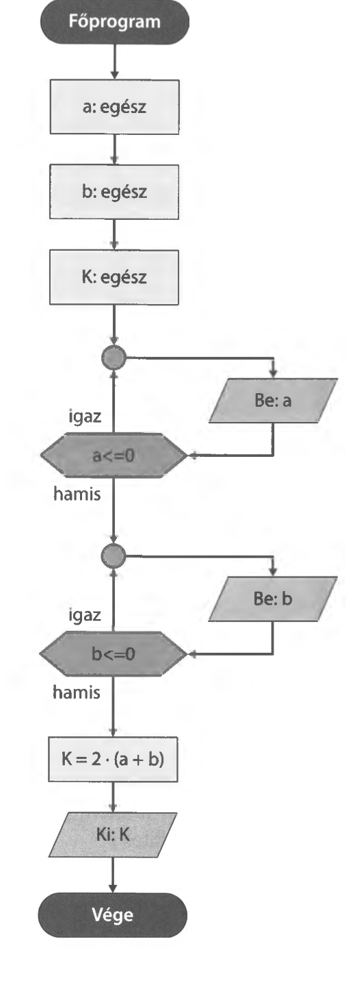

# 2.0. Programozási alapok

A programozás során konkrét feladatot vagy feladatokat oldunk meg. A feladat vagy feladatok megoldása során több, jól meghatározott lépést kell tennünk a feladat megfelelő elvégzése érdekében.

Nézzünk egy konkrét feladatot!
!!! example "Példafeladat"
    Készítsünk programot, amely bekéri egy téglalap alakú földterület oldalhosszúságait és meghatározza, hogy mennyi kerítésdrótra van szükség a terület körbekerítéséhez.

A megoldás lépései a következők:

### a) Specifikálás
Az első lépés a feladat lehető legpontosabb leírása, adott esetben megbeszélés a program készíttetőjével. Ebben a lépésben arra keresünk választ, hogy miből mit kell előállítani, milyen módszerrel. A leírás lehetőleg legyen mindig rövid, tömör, egyértelmű. A specifikálás során szöveges, illetve matematikai leírásokat is használhatunk.

A mi példánkban:
* **Bemenet:** `a`, `b` egész szám (mértékegység: méter). 
  * *Előfeltétel:* $a > 0$ és $b > 0$.
* **Kimenet:** `K` egész szám (mértékegység: méter).
* **Utófeltétel:** $K = 2 \cdot (a + b)$.

### b) Tervezés
A specifikáció alapján meg lehet tervezni a programot, elkészülhet a megoldás algoritmusa és az algoritmus által használt adatok leírása. Az algoritmusok leírása megvalósítható folyamatábrával, struktogrammal, Jackson-diagrammal, mondatszerű elemekkel, vagy mondatokkal leírva is. Az első három rajzos megvalósítás nyelvfüggetlen, ezért sokszor ezt használják.


{ width="200" }

### c) Kódolás
Az előzőleg megtervezett algoritmus megvalósítása a megbeszélt nyelven. A megvalósításhoz a konkrét programozási nyelv alapos ismerete szükséges. 

A programkód C# nyelven így néz ki:

```csharp
static void Main(string[] args)
{
    int a, b, K;
    Console.WriteLine("Téglalap kerületének kiszámítása");
    
    do
    {
        Console.WriteLine("Kérem adja meg az első oldalhosszúságot egész méterben");
        a = Convert.ToInt32(Console.ReadLine());
    } while (a <= 0);
    
    do
    {
        Console.WriteLine("Kérem adja meg az második oldalhosszúságot egész méterben");
        b = Convert.ToInt32(Console.ReadLine());
    } while (b <= 0);
    
    K = 2 * (a + b);
    Console.WriteLine("A szükséges kerítésdrót {0} méter", K);
    Console.ReadKey();
}
```

### d) Tesztelés
A program kipróbálása, esetleges hibák feltárása, a hibalista elkészítése. A tesztelés során a programunkat kipróbáljuk, lefuttatjuk különböző tesztadatokkal. A példánkban ilyen teszteset lehet a (5, 6; 5, -6; -6, -8; -7, 8) számpárok alkalmazása, vagy olyan eset, amikor az oldalhosszúságnál törtszámot (pl. 3.5) adunk meg.

### e) Hibakeresés
A hiba pontos helyének meghatározása. Hol és mit rontottunk el. Gondoljuk végig mit akartunk csinálni és mit csináltunk valójában. 

### f) Hibajavítás
Hogyan lesz jó a program a hiba kijavítása után. A javítás után ismételt tesztelés szükséges, hiszen a kijavított kódban is lehetnek hibák!

### g) Minőségvizsgálat, hatékonyság
Jobbá tehető-e a program, megvalósítható-e a gyorsabb programlefutás? Ennek elvégzése a programozási nyelv és algoritmusok nagyfokú ismeretét igényli, ezért nem tárgyaljuk részletesen.

### h) Dokumentálás
A program készítéséről, felhasználásáról, telepítéséről megfelelő dokumentációt kell készíteni. 
* A **felhasználói dokumentáció** a felhasználónak szól, így ábrákkal magyarázatokkal kell bemutatni a program használatát.
* A **fejlesztői dokumentáció** a program felépítését, a megvalósított gondolatmenetet (algoritmus és kód) az elvégzett teszteseteket, esetlegesen előforduló hibákat és azok javításait tartalmazza. 
* A **telepítési dokumentáció** a program telepítésének lépéseit írja le a szükséges hardver és szoftver követelményekkel együtt.

### i) Használat, karbantartás
A nagyobb programokat időnként módosítani kell. Ilyen karbantartást igényelnek pl. a könyvelőprogramok (adókulcsváltozás, törvényváltozás), a számlázó programok stb. A szükséges módosításokat mindig el kell végezni, és a módosításokat ismételten tesztelni kell.