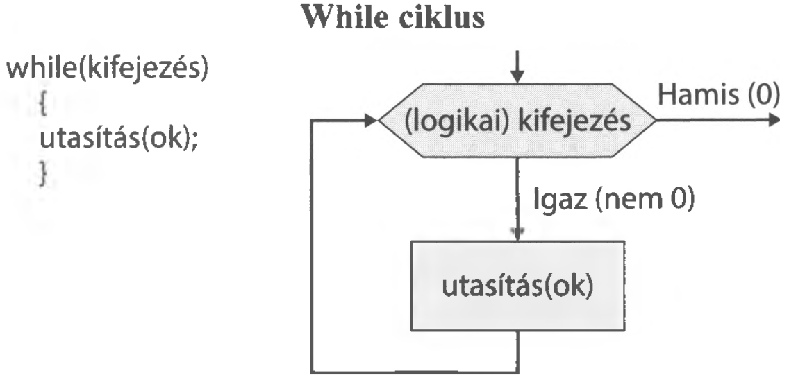
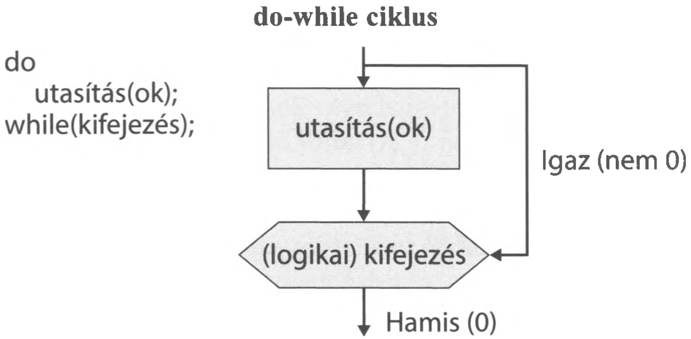

# 2.11. Ciklusok

A programozás során nagyon sokszor előfordul, hogy egy adott utasítást vagy utasítássorozatot többször is végre kell hajtani. Erre valók a ciklusok (más néven ismétléses vezérlési szerkezetek). 

A ciklus két fő részből áll:

1. **Ciklusfej (vagy ciklusvég):** Itt található a feltétel, amely meghatározza, hogy hányszor (meddig) fusson a ciklus.

2. **Ciklusmag:** Azon utasítások halmaza, amelyeket ismételni szeretnénk.


A C#-ban három alapvető ciklustípust különböztetünk meg.

---

### 2.11.1. Elöltesztelő ciklus (`while`)

Az elöltesztelő ciklus esetében a feltétel vizsgálata a ciklusmag végrehajtása **előtt** történik meg. A ciklusmag utasításai addig ismétlődnek, amíg a feltétel IGAZ (`true`). 


**Általános forma:**
```csharp
while (feltétel)
{
    // utasítások (ciklusmag)
}
```

!!! warning "Fontos jellemző"
    Mivel a feltételvizsgálat legelöl van, előfordulhat, hogy a ciklusmag **egyszer sem hajtódik végre**, ha a feltétel már a legelső vizsgálatkor is hamis!


{ width="450" }


!!! example "13. feladat"
    Írjuk ki a képernyőre a számokat 1-től 10-ig egymás alá egy `while` ciklus segítségével! Név: Ciklus1.

**Megoldás:**
```csharp
static void Main(string[] args)
{
    int i = 1; // kezdőérték beállítása
    
    Console.WriteLine("Számok 1-től 10-ig:");
    
    while (i <= 10) // feltétel: amíg i kisebb vagy egyenlő, mint 10
    {
        Console.WriteLine(i);
        i++; // i értékének növelése 1-gyel (nagyon fontos, különben végtelen ciklust kapunk!)
    }
    
    Console.ReadKey();
}
```

---

### 2.11.2. Hátultesztelő ciklus (`do-while`)

A hátultesztelő ciklus esetében a ciklusmag végrehajtása történik meg először, és csak utána következik a feltétel vizsgálata. A ciklusmag itt is addig ismétlődik, amíg a feltétel IGAZ.

**Általános forma:**
```csharp
do
{
    // utasítások (ciklusmag)
}
while (feltétel); 
```
*(Figyelem: Ennél a ciklusnál a `while(feltétel)` után **kötelező** a pontosvessző!)*

{ width="450" }

!!! tip "A hátultesztelő ciklus előnye"
    Mivel a feltételvizsgálat a ciklus végén van, a ciklusmag **legalább egyszer mindenképpen lefut**! Ez a típus tökéletes például adatbekérés ellenőrzésére (amikor legalább egyszer fel kell tenni a kérdést a felhasználónak).

!!! example "14. feladat"
    Kérjünk be egy pozitív egész számot a felhasználótól! Ha a megadott szám 0 vagy negatív, a program kérje be újra mindaddig, amíg helyes (pozitív) adatot nem kap! Név: Ciklus2.

**Megoldás:**
```csharp
static void Main(string[] args)
{
    int szam;
    
    do
    {
        Console.Write("Kérek egy pozitív egész számot: ");
        szam = Convert.ToInt32(Console.ReadLine());
        
        if (szam <= 0)
        {
            Console.WriteLine("Hibás adat! Próbálja újra!");
        }
        
    } while (szam <= 0); // Ismételjük, AMÍG a szám rossz (kisebb vagy egyenlő, mint 0)
    
    Console.WriteLine("Köszönöm, a megadott helyes szám: {0}", szam);
    Console.ReadKey();
}
```

---

### 2.11.3. Számláló ciklus (`for`)

A `for` ciklust akkor a legcélszerűbb használni, amikor **előre pontosan tudjuk, hogy hányszor szeretnénk végrehajtani** a ciklusmagot (például menjünk végig 10 elemen, vagy számoljunk el 1-től 100-ig). Ez a legkompaktabb ciklusforma, mert egyetlen sorban tartalmazza a kezdőértéket, a feltételt és a léptetést.


**Általános forma:**
```csharp
for (kifejezés1; kifejezés2; kifejezés3)
{
    // utasítások (ciklusmag)
}
```
A kifejezések általában a következőket jelentik:

- kifejezés***1*** : Kezdeti értékadás a ciklusváltozónak.

- kifejezés***2***: A lefutási feltétel(ek) megfogalmazása. Lefutási feltételként nemcsak
a ciklusváltozóval kapcsolatos feltételt lehet megadni, hanem bármilyen
más feltételt is.
- kifejezés***3***: A ciklusváltozó növelése vagy csökkentése.

Nézzünk erre egy példát C#-ban:

```csharp
for ( i = 1 ; i <= 10 ; i++ )
{
utasítások
}
```

A for utasítás után van a ciklus fej része. Ebben az ***i*** a ciklusváltozó, melynek kezdőértéke
1, végértéke 10. Az i++ pedig egy speciális C# utasítás, amely az i jelenlegi
értékét növeli eggyel. ( Az i— pedig csökkenti ) Mindez azt jelenti, hogy a
magban lévő utasítások lefutnak pontosan 10-szer, amikor is az i = 1, az i = 2, ...
és végül az i = 10.


!!! example "15. feladat"
    Írjuk ki a képernyőre az első 10 páros számot egy `for` ciklus segítségével! Név: Ciklus3.

**Megoldás:**
```csharp
static void Main(string[] args)
{
    Console.WriteLine("Az első 10 páros szám:");
    
    // i 2-től indul; amíg i <= 20; i-t kettesével növeljük
    for (int i = 2; i <= 20; i += 2) 
    {
        Console.WriteLine(i);
    }
    
    Console.ReadKey();
}
```

---

### Gyakorló feladatok

1. Írjon programot, amely kiírja 10-től 1-ig a számokat csökkenő sorrendben! (Használjon `for` ciklust!)
2. Kérjen be egy számot, majd írja ki a szorzótábláját 1-től 10-ig! 
   *(Például ha a szám 5, a kimenet: 1 * 5 = 5, 2 * 5 = 10...)*
3. Kérjen be egy jelszót a felhasználótól! A program addig kérje újra a jelszót, amíg az nem egyezik meg egy előre megadott (pl. "titok123") szöveggel! (Használjon `do-while` ciklust!)
4. Generáljon 5 darab véletlen számot az `[1, 50]` intervallumból, és írja ki őket egymás mellé, szóközzel elválasztva!