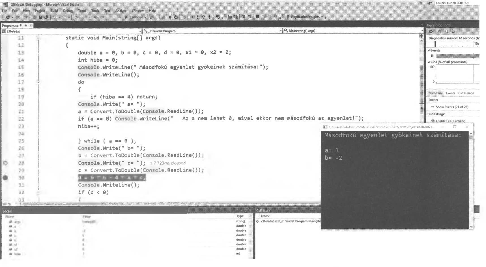

# 2.15. Hibakeresés, tesztelés

A hibakereséssel megállapíthatjuk a hiba helyét, okát és futás közben információt kaphatunk a programról, a programozás során használt eszközeink, változóink aktuális értékéről. A hibák egy részét már a kódbeírás közben azonnal láthatjuk és javíthatjuk is. Vannak azonban olyan hibák, amelyek csak futtatás közben derülnek ki. Ezt a fordítóprogram jelzi, megszakítja a program futását és magyarázatot is fűz a hiba megjelenésének helyén. Ezen hibák javítására van több lehetőség is, amellyel könnyen javíthatjuk a munkánkat.

{ width="600" }

C#-ben utasításonként futtathatjuk a programunkat az <kbd>F11</kbd> billentyű segítségével, ami nagy segítség lehet a tesztelés, hibakeresés során. A hibakeresés során még két nagyon hasznos lehetőség áll rendelkezésünkre, amelyek igazán megkönnyítik a munkánkat. Az egyik a **töréspont** elhelyezése, a másik pedig a nyomkövetés, a **változók aktuális értékeinek megtekintése**. Mindez az alábbiak szerint valósulhat meg:

A program kódjának tetszőleges sorában a sor elejére kattintva töréspontot hozunk létre és megjelenik egy kis piros kör, ahol a program futása megáll. A töréspontokból igény szerint több is elhelyezhető a programban.

Ha tehát a programot futtatjuk a start gombra kattintva vagy az <kbd>F5</kbd> billentyűvel, akkor a program lefut a szokásos módon addig a sorig, amelyben a kis piros kör van. Ezt követően a hibakeresés, vagy tesztelés során célszerű az <kbd>F11</kbd>-el áttérni az utasításonkénti futtatásra és ezzel egy időben a bal alsó részen a **Locals ablakban** láthatjuk a programban használt eszközeink - többnyire a változók - aktuális értékét. A futtatás során további segítség, hogy az éppen aktuális sor sárga háttérrel jelenik meg és sor elején egy sárga, jobbra mutató nyíl látható. Mindeközben láthatjuk a programunk futásának aktuális állapotát is.

Ezen lehetőségekkel nagyon könnyű az esetleges hibát, hibákat megkeresni és javítani, ill. a programot tesztelni.

---

### Gyakorló feladatok

1.  Készítsen programot, amely egy 10-es számrendszerbeli számot átvált 2-es számrendszerbe!
2.  Készítsen programot, amely egy 2-es számrendszerbeli számot átvált 10-es számrendszerbe!
3.  Egy tanuló 10 kérdésből álló tesztlapot tölt ki. Minden kérdésre a választ az abc első 4 betűje (a, b, c, d) jelöli. Ismerjük a 10 kérdés helyes megoldását a betűjelekkel megadva. Készítsünk programot, amely bekéri a tanulótól a feladatonkénti megoldásokat, majd meghatározza hány helyes válasza(pontja) volt a tanulónak! Minden helyes válasz 1 pontot ér.
4.  Bővítse az előző programot azzal, hogy csak a lehetséges tippeket fogadja el a program a tanulótól! (A válaszok csak a, b, c, d lehet.)
5.  Bővítse úgy a 3. feladatot, hogy több tanuló tölti ki a tesztet! A program kérdezze meg a tanulók számát és utána kérje be egyesével a tanulók válaszait!
6.  A 3. feladatot bővítse tovább úgy, hogy az eredményt osztályozza is le a program! Az osztályozáshoz szükséges százalékok:

    | Százalékérték | Érdemjegy |
    | :--- | :--- |
    | 0-19% | Elégtelen (1) |
    | 20-39% | Elégséges (2) |
    | 40-59% | Közepes (3) |
    | 60-79% | Jó (4) |
    | 80-100% | Jeles (5) |

7.  A 3. feladatot oldja meg úgy is, hogy a feladatok különböző pontszámot érjenek! Számítsa ki az összpontszámot, a maximális összpontszámot, és a 6. feladat táblázata alapján végezze el az osztályozást!
8.  Kérjünk be egy számot 1 és 100 között, majd írassuk ki betűvel!
9.  Írassuk ki n-től m-ig a 7-tel osztható számokat, n nem feltétlenül kisebb, mint m!
10. Írassuk ki While ciklussal 0-100-ig a 3-mal osztható számokat!
11. A következő feladat bekér egy 0 és 1 közötti számot, amelyet radiánként kezel és megadja a hozzátartozó szinusz és koszinusz szöget. A program 10 hibát tartalmaz. Melyek ezek és hol vannak? Javítsa ki úgy a programot, hogy az helyesen működjön és futtatható legyen!
