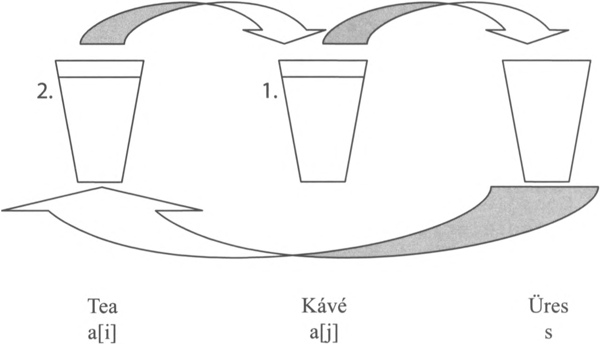

# 3.9. Rendezés

A programozás során az egyik leggyakoribb feladat az adatok valamilyen szempont szerinti sorba rendezése. Legyen szó egy webáruház termékeinek ár szerinti listázásáról, vagy a diákok névsorba szedéséről, a háttérben mindig valamilyen rendezési algoritmus fut. 

A rendezés történhet **növekvő** (kicsitől a nagy felé) vagy **csökkenő** (nagytól a kicsi felé) sorrendben. Karakterek és szövegek esetén ez az ABC sorrendet jelenti.

## A legfontosabb alaplépés: A változók értékének felcserélése

Mielőtt bármilyen tömböt sorba rendeznénk, meg kell oldanunk egy alapvető problémát: hogyan cseréljük meg két változó értékét? 

Képzeld el, hogy van két poharad. Az egyikben (`A` pohár) narancslé van, a másikban (`B` pohár) kóla. Szeretnéd kicserélni a tartalmukat úgy, hogy az `A`-ban legyen a kóla, a `B`-ben a narancslé. Ha egyszerűen átöntöd az egyiket a másikba, a két folyadék összekeveredik. Szükséged van egy harmadik, **üres pohárra** (egy segédváltozóra)!



*(A fenti ábrán látható a csere folyamata lépésről lépésre)*

A programozásban a csere pontosan így működik. Létrehozunk egy `seged` változót, és ezen keresztül hajtjuk végre a cserét három lépésben:

```csharp
int seged = a; // 1. lépés: Az 'A' tartalmát átöntjük az üres 'seged' pohárba
a = b;         // 2. lépés: A 'B' tartalmát átöntjük az immár üres 'A' pohárba
b = seged;     // 3. lépés: A 'seged' pohárból (ami eredetileg az 'A' volt) áttöltjük az anyagot a 'B'-be
```

Most, hogy tudunk cserélni, nézzük meg a két legismertebb alap-algoritmust a rendezésre!

---

#  3.9.1. Egyszerű cserés rendezés

Ez a legkönnyebben megérthető algoritmus. A lényege: fogjuk a tömb legelső elemét, és összehasonlítjuk az összes mögötte lévő elemmel. Ha találunk nála kisebbet (növekvő rendezés esetén), akkor azonnal kicseréljük őket. Mire a vizsgálat végére érünk, garantáltan a legkisebb elem kerül a tömb legelső helyére.
Ezután fogjuk a második elemet, és azt is összehasonlítjuk az összes *mögötte* lévővel. Ezt addig ismételjük, amíg el nem érünk a tömb végéig.

**A logikához két egymásba ágyazott `for` ciklus kell:**
* A **külső ciklus** (`i`) mondja meg, hogy épp melyik helyre keressük a megfelelő elemet.
* A **belső ciklus** (`j`) mindig az `i` utáni elemtől indul (`j = i + 1`), és végigmegy a maradékon, hogy összehasonlítsa őket az `i`-edik elemmel.

!!! example "31. feladat"
    Állítsunk elő véletlenszerűen 10 egész számot a `[0, 100]` tartományból! Írjuk ki a generált számokat, majd rendezzük őket **növekvő sorrendbe** egyszerű cserés rendezéssel, és írjuk ki a rendezett tömböt is!
    Név: Egyszerű cserés rendezés

**Megoldás:**
```csharp
static void Main(string[] args)
{
    int[] a = new int[10];
    Random vsz = new Random();

    Console.WriteLine(" Az eredeti (rendezetlen) számok:");
    for (int i = 0; i < 10; i++)
    {
        a[i] = vsz.Next(101);
        Console.Write("{0,4}", a[i]);
    }
    Console.WriteLine("\n"); // Sortörés és egy üres sor

    // --- EGYSZERŰ CSERÉS RENDEZÉS ALGORITMUSA ---
    for (int i = 0; i < 10 - 1; i++) // A külső ciklus az utolsó előtti elemig megy
    {
        for (int j = i + 1; j < 10; j++) // A belső ciklus az i utáni elemtől indul
        {
            if (a[i] > a[j]) // Ha a bal oldali nagyobb, mint a jobb oldali, akkor cserélünk
            {
                int seged = a[i];
                a[i] = a[j];
                a[j] = seged;
            }
        }
    }

    Console.WriteLine(" A rendezett számok (növekvő):");
    for (int i = 0; i < 10; i++)
    {
        Console.Write("{0,4}", a[i]);
    }

    Console.ReadKey();
}
```

---

# 3.9.2. Minimumkiválasztásos rendezés

Az egyszerű cserés rendezés bár könnyen érthető, nagyon lassú tud lenni. Miért? Mert ahogy halad végig a belső ciklus, lehet, hogy ötször is végrehajtja a "poharas cserét", mire megtalálja az abszolút legkisebbet. A számítógép számára a memória írása (a változók cseréje) "drága" művelet.

**A minimumkiválasztásos rendezés felokosítja ezt a folyamatot!**
Ahelyett, hogy azonnal cserélne, csak *megjegyzi*, hogy hányadik indexen látta az eddigi legkisebb számot. A belső ciklus végigmegy, csak vizsgálódik (ami nagyon gyors), és csak a legvégén, amikor már biztosan tudja, hol van a legkisebb elem, hajt végre **egyetlenegy cserét**.

!!! example "32. feladat"
    Generáljunk 10 számot, írjuk ki őket, majd rendezzük **csökkenő sorrendbe** (elöl a legnagyobbak) minimumkiválasztásos rendezéssel! Mivel most csökkenő sorrendet kérünk, valójában mindig a "maximumot" fogjuk kiválasztani a maradékból.
    Név: Minimumkiválasztásos rendezés (Csökkenő)

**Megoldás:**
```csharp
static void Main(string[] args)
{
    int[] a = new int[10];
    Random vsz = new Random();

    Console.WriteLine(" Az eredeti tömb:");
    for (int i = 0; i < 10; i++)
    {
        a[i] = vsz.Next(101);
        Console.Write("{0,4}", a[i]);
    }
    Console.WriteLine("\n");

    // --- MINIMUMKIVÁLASZTÁSOS RENDEZÉS ALGORITMUSA ---
    for (int i = 0; i < 10 - 1; i++)
    {
        int maxIndex = i; // Feltételezzük, hogy az aktuális 'i' helyen van a legnagyobb szám

        for (int j = i + 1; j < 10; j++)
        {
            if (a[j] > a[maxIndex]) // Keresünk nála még nagyobbat (mert csökkenőbe rendezünk)
            {
                maxIndex = j; // Csak az indexét jegyezzük meg, NINCS csere!
            }
        }

        // Amikor a belső ciklus lefutott, megnézzük, találtunk-e nagyobbat az eredetinél
        if (maxIndex != i) 
        {
            // Csak ekkor, és csak egyszer cserélünk!
            int seged = a[i];
            a[i] = a[maxIndex];
            a[maxIndex] = seged;
        }
    }

    Console.WriteLine(" A rendezett számok (csökkenő):");
    for (int i = 0; i < 10; i++)
    {
        Console.Write("{0,4}", a[i]);
    }

    Console.ReadKey();
}
```

??? success "Összefoglaló - Mi a különbség a kettő között?"
    Mindkét algoritmus ugyanazt a végeredményt adja. A különbség a háttérben elvégzett munka mennyiségében van. 
    Képzeld el, hogy a tanár egy 30 fős osztályt akar magasság szerint sorba állítani. 

    - Az **egyszerű cserés** módszerrel a tanár az első embert folyton cserélgeti a sorban mindenkivel, aki nála alacsonyabb, amíg nagy nehezen be nem kerül a legkisebb előre. Rengeteg a mozgás.

    - A **minimumkiválasztásos** módszernél a tanár végignéz az osztályon, kiválasztja szemmel a legalacsonyabb diákot, és megkéri, hogy cseréljen helyet a sor elején állóval. Egyetlen helycsere történt! Ez sokkal hatékonyabb.