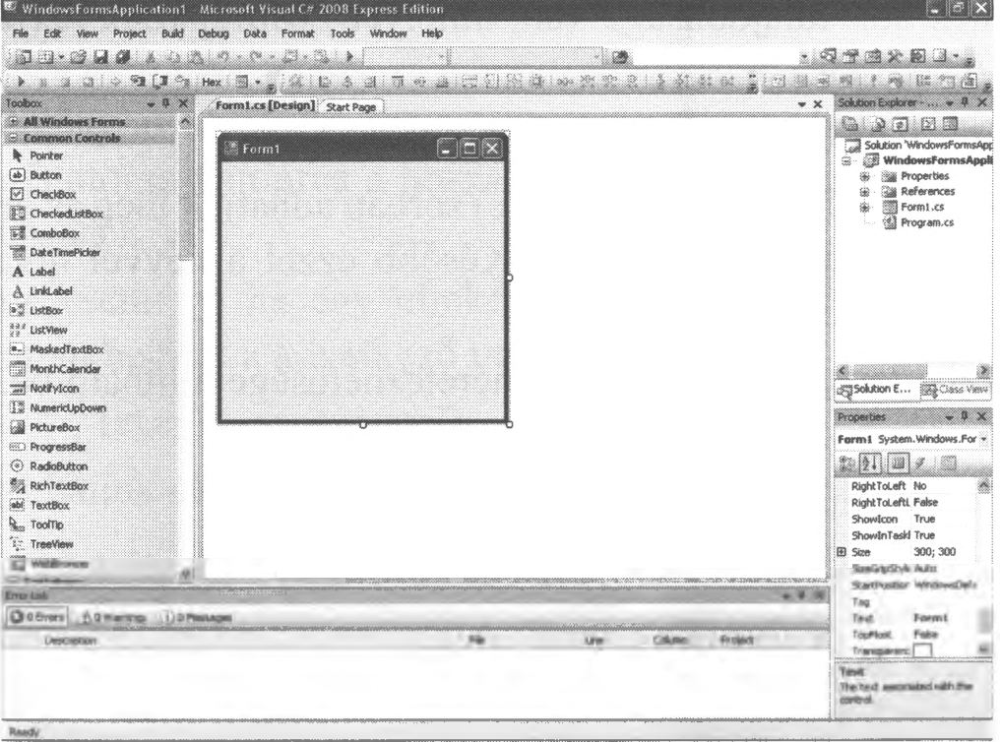

# 6.1. A Windows Formok használata

Ha Windows Form-ot szeretnénk használni, akkor a `New Project` után a `Windows Forms Application`-t kell választani, és megadni a Project nevét. Ekkor az előttünk megjelenő képernyő így jelenik meg:

Ha mégsem ezt látnánk, akkor célszerű az alábbi beállításokat elvégezni:
A `View` menü alatt válasszuk ki az `Error List`, a `Properties Window`, a `Solution Explorer` és a `Toolbox` almenüket.

A programkészítést most már két részre kell bontani:

1. a megjelenés (design) kialakítása (grafikus képernyő, egérhasználat),
2. a program szerkezeti felépítése, működése (szöveges képernyő).

A `Solution Explorer` ablakban válthatunk a kettő között, ahol a `Form1.cs` a grafikus, a `Program.cs` pedig a szöveges rész.

A munkavégzés területe elsősorban a középen elhelyezkedő `Form1.cs [Design]` ablakban lesz, amely mellett a fejrészben `Start Page` látható.

A `Properties` ablakban az aktuális (kijelölt) objektum tulajdonságait állíthatjuk be, amelyről majd később lesz szó részletesen.

A programkészítéshez először a `Toolbox` menüben található eszközökkel kell megismerkedni. Egyelőre csak a legfontosabb elemekkel ismerkedünk meg.

Ilyen elem a `Button` (gomb) és a `Label` (címke). Az egérrel a megfelelő elemet behúzhatjuk a Form ablakba. Az elhelyezésben segítenek a rendező vonalak, amelyek a pontos, vízszintes és függőleges beállítást teszik lehetővé.