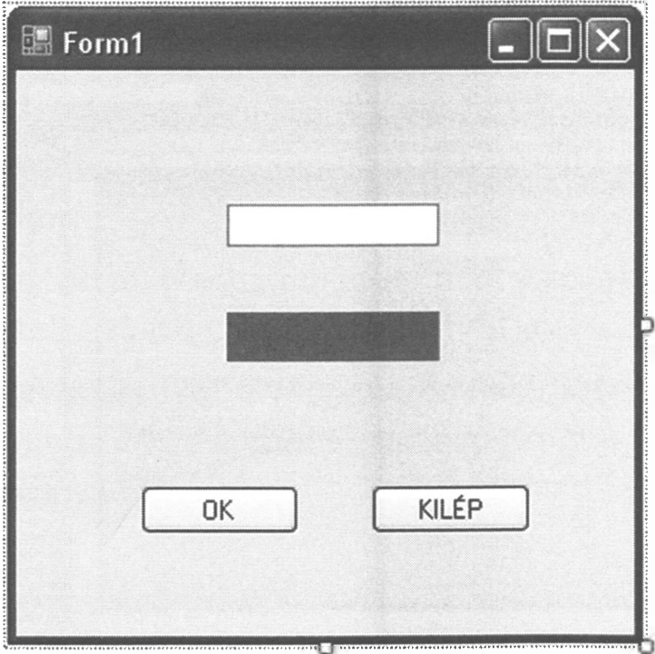
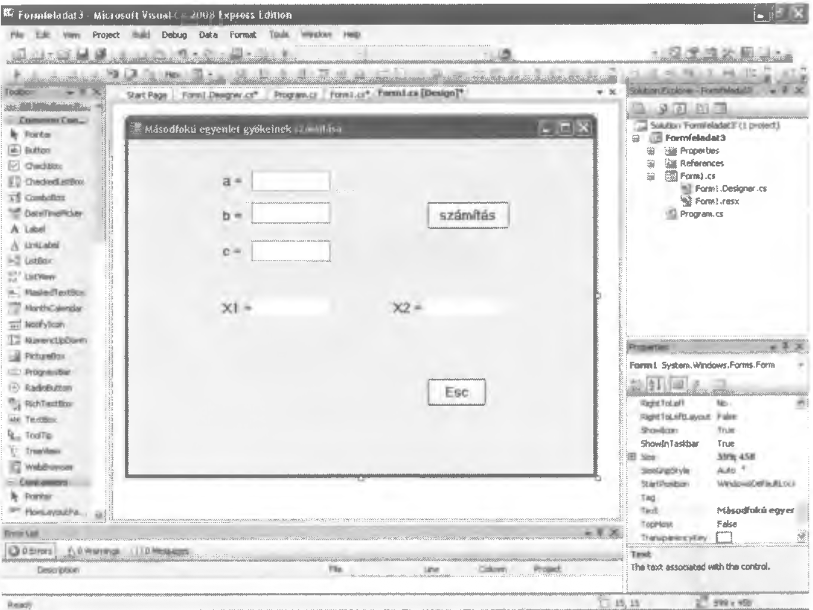
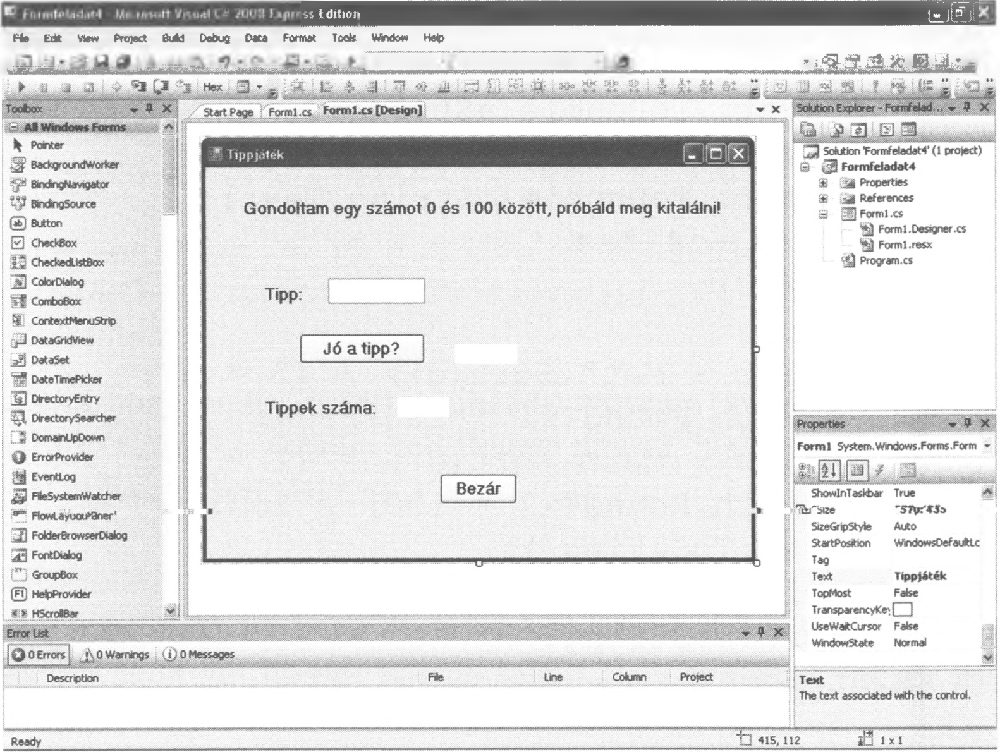
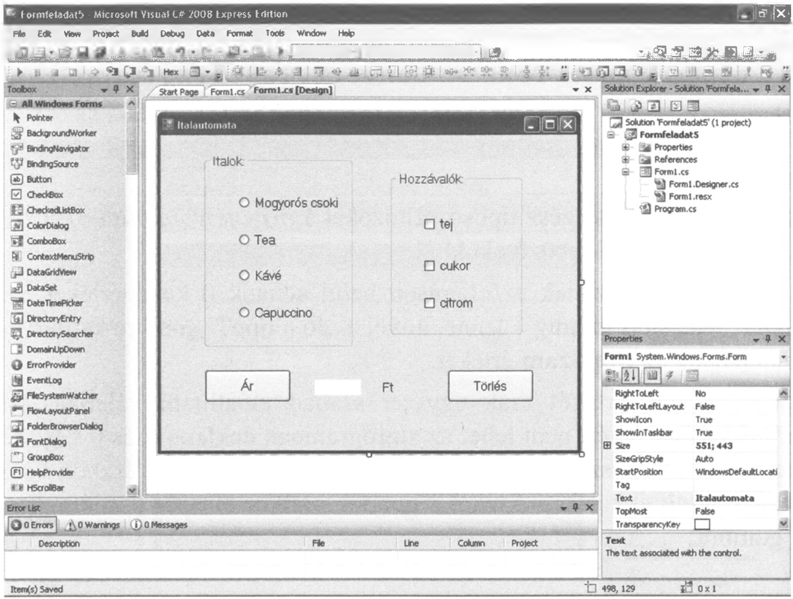
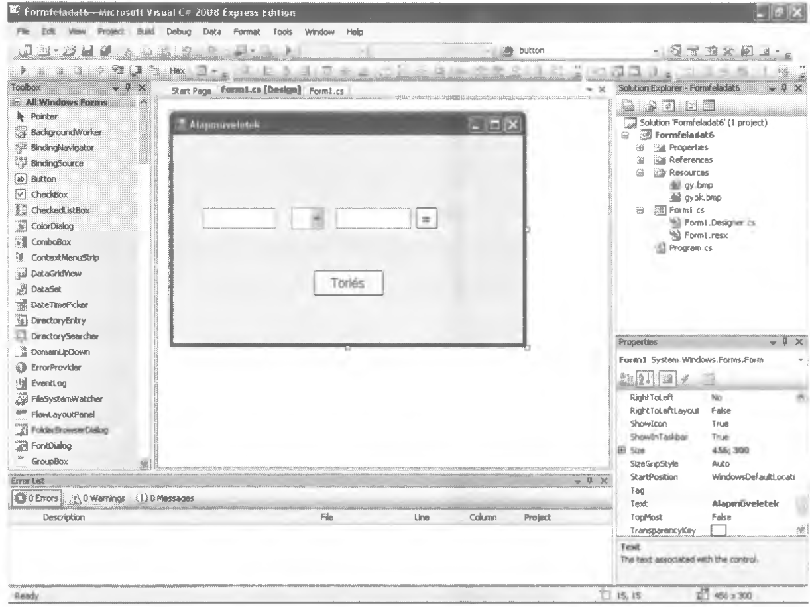
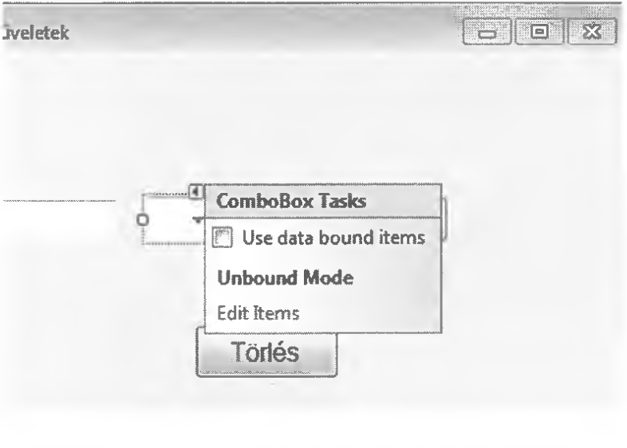
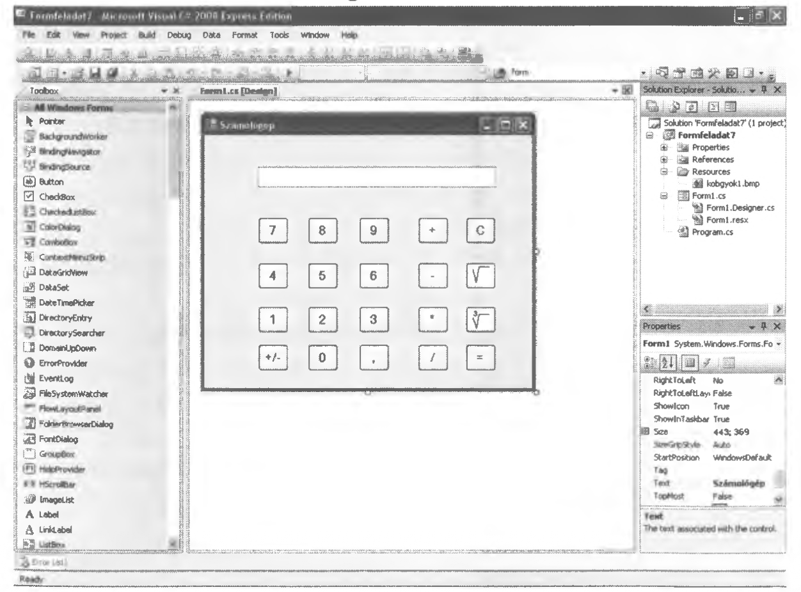

# 6.4. A TextBox

A `TextBox` a `Label`-hez hasonló szöveges vezérlő, amely a felhasználótól beérkező üzenetet képes fogadni. Mivel minden esetben csak szöveget tudunk bekérni, elfogadni a felhasználótól, így itt szükség van konvertálásra, ha később más típusú adatként szeretnénk használni a szövegdoboz tartalmát. Az átváltást itt is a `Convert.To...` utasítással végezhetjük.

!!! example "56. feladat"
    Hozzunk létre egy szövegdobozt, egy címkét és két gombot egy ablakban! Írjuk ki a szövegdobozban megadott szám kétszeresét!
    Név: Formfeladat2

**Megoldás:**

Húzzunk a `Form1` ablakba egy `TextBox`-ot fehér, egy `Label`-t piros háttérrel és 2 `Button`-t az alábbi ábra szerint!

{width="300"}

A KILÉP gombra kattintva írjuk be a `button2_Click` eljárásba: `this.Close();`
Az OK gombhoz tartozó eljárásba pedig az alábbiakat:

```csharp
private void button1_Click(object sender, EventArgs e)
{
    double szam = 0;
    szam = Convert.ToDouble(szamString.Text);
    szoveg.Text = (2 * szam).ToString();
}
```

Vagy egyszerűbben:

```csharp
private void button1_Click(object sender, EventArgs e)
{
    szoveg.Text = (2 * Convert.ToDouble(szamString.Text)).ToString();
}
```

Ne felejtsük el, hogy minden bekért és kiírt adat szöveges típusú, ezért a `szamString` nevű `TextBox` értékét konvertálni kell `Double` típussá, majd a szám kétszeresét a `ToString()`-gel szöveggé kell alakítani.

!!! example "57. feladat"
    Kérjük be a másodfokú egyenlet együtthatóit három szövegdobozban és írjuk ki az egyenlet gyökeit két tizedes pontossággal! Ha nincs gyök, akkor írjuk ki: „Nincs gyök”.
    Név: Formfeladat3

**Megoldás:**

Hozzuk létre az alábbi formának megfelelő ablakot!



Az Esc (KILÉP) gombra kattintva írjuk be a kilépéshez szükséges `this.Close();` utasítást, majd a számítás gombra kattintva az alábbi programrészletet!

```csharp
private void button1_Click(object sender, EventArgs e)
{
    double x1 = 0, x2 = 0, a = 0, b = 0, c = 0, d = 0;
    string sz = "";
    
    a = Convert.ToDouble(aString.Text);
    b = Convert.ToDouble(bString.Text);
    c = Convert.ToDouble(cString.Text);
    
    d = b * b - 4 * a * c;
    
    if (d >= 0)
    {
        x1 = (-b + Math.Sqrt(d)) / (2 * a);
        x1 = Math.Round(x1 * 100) / 100;
        
        x2 = (-b - Math.Sqrt(d)) / (2 * a);
        x2 = Math.Round(x2 * 100) / 100;
        
        sz = x1.ToString();
        x1String.Text = sz;
        
        sz = x2.ToString();
        x2String.Text = sz;
    }
    else
    {
        nincs.Text = "Nincs gyök";
    }
}
```

Ez a program semmivel sem tud többet a korábbi konzolos (10. feladat) változatnál, de szebb, és az egér használata is pluszként jelentkezik.

Itt érdemes megjegyezni, hogy az F11 billentyű segítségével egy soronkénti programfuttatásra van lehetőségünk, amelynek során a változók futás közbeni aktuális értékét is nyomon követhetjük. Ez a módszer rendkívül hasznos a programok működésének megértésekor.

Most nézzünk meg egy olyan programot, ahol nem csak egy (vagy több) gombhoz tartozó alprogramba kell írnunk, hanem azon kívül is.
Előfordulhat olyan eset is, amikor a változók deklarációja nem kerülhet az alprogramon belülre. Ilyenkor az adott gombhoz tartozó programrész fölé célszerű elhelyezni a változók deklarációját.

!!! example "58. feladat"
    Írjunk programot, amely gondol egy számot 0 és 100 között, majd vár egy tippet és ennek értékétől függően tájékoztatja a felhasználót, hogy a tipp nagyobb-e, kisebb-e, mint a gondolt szám vagy egyenlő azzal! Írjuk ki a tippek számát is!
    Név: Formfeladat4

**Megoldás:**

Hozzuk létre az alábbi formának megfelelő ablakot!



A szövegdoboz neve legyen `szamString`, a „Jó a tipp?” utáni címke neve `talalString`, a „Tippek száma” utáni címkéé pedig `tippekSzama`! A Bezár gombhoz írjuk a már szokásos `this.Close();` utasítást!

A „Jó a tipp?” gombhoz tartozó programrész:

```csharp
int tippSzam = 0, gondol = 0;

private void button1_Click(object sender, EventArgs e)
{
    int szam = 0;
    talalString.Text = "";
    
    if (tippSzam == 0)
    {
        Random vsz = new Random();
        gondol = vsz.Next(101);
    }
    
    szam = Convert.ToInt16(szamString.Text);
    
    if (szam == gondol) talalString.Text = "Eltaláltad";
    if (szam > gondol) talalString.Text = "Ennél kisebb";
    if (szam < gondol) talalString.Text = "Ennél nagyobb";
    
    tippSzam++;
    tippekSzama.Text = Convert.ToString(tippSzam);
}
```

**Megjegyzés:**
A `tippSzam` és `gondol` egész típusú változókat a `private void button1_Click` rész előtt kell deklarálni különböző okokból.
Ha a `tippSzam` változónak az eljáráson belül adnánk 0 kezdőértéket, akkor a `tippSzam++` utasítás mindig 1 lenne, mivel a „Jó a tipp?” gombra kattintva állandóan nulláznánk a `tippSzam` értékét.
A `gondol` változó értékét csak egyszer szabad előállítani véletlenszerűen a `button1_Click`-ben, ezért nem lehet az alprogramban deklarálni és 0 kezdőértéket adni neki. Ezt az egyszeri előállítást az `if (tippSzam == 0)` részben valósítjuk meg, vagyis csak akkor kap értéket a `gondol`, amikor először kattintunk a „Jó a tipp?” gombra.

---

A következő feladat megoldásához szükség lesz 3 új elem, a `GroupBox`, a `RadioButton` és a `CheckBox` ismeretére.

*   A `GroupBox` egy logikailag összefüggő területet jelöl ki, amelyben különböző vezérlőelemek helyezhetők el. A `GroupBox` megjelenhet felirattal vagy felirat nélkül. A `GroupBox`-ban általában `RadioButton` vagy `CheckBox` elemeket helyezünk el.
*   A `CheckBox` és a `RadioButton` feladata majdnem megegyezik. Mindkét esetben egy listából választhat a felhasználó, de a `CheckBox`-nál a lista elemeinek kombinációját választhatjuk ki, a `RadioButton`-nal viszont csak egy elemet.

!!! example "59. feladat"
    Írjunk programot, amely egy italautomata által felajánlott italok és hozzávalók kiválasztását teszi lehetővé! Az italok: mogyorós csoki, tea, kávé, capuccino. A lehetséges hozzávalók: tej, cukor, citrom. A mogyorós csokihoz ne lehessen hozzávalót választani, a teánál a tejet, a kávénál, és a capuccinónál pedig a citromot tiltsuk le! Az ár gombra kattintva írjuk ki a kiválasztott termékek árát, a törlés gombra pedig töröljük az árat! Az árak: mogyorós csoki és kávé 60 Ft, tea és capuccino 50 Ft. A tej 15, a cukor 10 a citrom pedig 5 Ft legyen!
    Név: Formfeladat5

**Megoldás:**

Hozzuk létre az alábbi formának megfelelő ablakot!



A `RadioButton` gombokhoz tartozó megnevezések: `csoki`, `tea`, `kave`, `capu`.
A `CheckBox`-okhoz tartozó megnevezések: `tej`, `cukor`, `citrom`.
Az Ár gomb melletti `Label` neve: `osszegsz`.

A `CheckBox` és a `RadioButton` használata esetén két fontos lehetőséget kell megemlíteni.
1. a vezérlőelemek állapotának, beállításának módja.
2. a vezérlőelemek jelölhetőségének, engedélyezésének, vagy tiltásának módja.

**Az állapotok beállítása:**
*   `CheckBox1.Checked = true;` (a vezérlőelem ki van jelölve)
*   `CheckBox1.Checked = false;` (a vezérlőelem nincs kijelölve)

**A jelölhetőség engedélyezése/tiltása:**
*   A jelölhetőség engedélyezése: `CheckBox1.AutoCheck = true;`
*   A jelölhetőség tiltása: `CheckBox1.AutoCheck = false;`

A `CheckBox1` helyén természetesen a vezérlőelemek neve szerepel a programban, akár `RadioButton`-ról, akár `CheckBox`-ról van szó.

A program kódja:

```csharp
namespace Formfeladat5
{
    public partial class Form1 : Form
    {
        public Form1()
        {
            InitializeComponent();
        }

        private void button1_Click(object sender, EventArgs e)
        {
            int osszeg = 0;
            
            if (csoki.Checked) osszeg = 60;
            if (tea.Checked) osszeg = 50;
            if (kave.Checked) osszeg = 60;
            if (capu.Checked) osszeg = 50;
            
            if (tej.Checked) osszeg = osszeg + 15;
            if (cukor.Checked) osszeg = osszeg + 10;
            if (citrom.Checked) osszeg = osszeg + 5;
            
            osszegsz.Text = Convert.ToString(osszeg);
        }

        private void csoki_CheckedChanged(object sender, EventArgs e)
        {
            osszegsz.Text = "";
            if (csoki.Checked)
            {
                tej.Checked = false;
                cukor.Checked = false;
                citrom.Checked = false;
                tej.AutoCheck = false;
                cukor.AutoCheck = false;
                citrom.AutoCheck = false;
            }
            else
            {
                tej.AutoCheck = true;
                cukor.AutoCheck = true;
                citrom.AutoCheck = true;
            }
        }

        private void kave_CheckedChanged(object sender, EventArgs e)
        {
            osszegsz.Text = "";
            if (kave.Checked)
            {
                tej.Checked = false;
                cukor.Checked = false;
                citrom.Checked = false;
                citrom.AutoCheck = false;
            }
            else
            {
                citrom.AutoCheck = true;
            }
        }

        private void tea_CheckedChanged(object sender, EventArgs e)
        {
            osszegsz.Text = "";
            if (tea.Checked)
            {
                tej.Checked = false;
                cukor.Checked = false;
                citrom.Checked = false;
                tej.AutoCheck = false;
            }
            else
            {
                tej.AutoCheck = true;
            }
        }

        private void capu_CheckedChanged(object sender, EventArgs e)
        {
            osszegsz.Text = "";
            if (capu.Checked)
            {
                tej.Checked = false;
                cukor.Checked = false;
                citrom.Checked = false;
                citrom.AutoCheck = false;
            }
            else
            {
                citrom.AutoCheck = true;
            }
        }

        private void button2_Click(object sender, EventArgs e)
        {
            osszegsz.Text = "";
            csoki.Checked = false;
            tea.Checked = false;
            kave.Checked = false;
            capu.Checked = false;
            tej.Checked = false;
            cukor.Checked = false;
            citrom.Checked = false;
        }
    }
}
```

A szoftverfejlesztésben az évek során több projektmenedzsment modell alakult ki azért, hogy egy keretrendszer vázat alkossanak a fejlesztés folyamatáról. Ezt útmutatóként lehet használni a hatékony és átgondolt fejlesztéseknél, ahol adott az egyes folyamatlépések sorrendje, elvégzésük módja és ideje.

A szoftverfejlesztési modellek történeti fejlődése során több modell is kialakult, melyek közül az iteratív modellel ismerkedünk meg. Ez a modell kockázatvezérelt szoftverfejlesztési módszeren alapul. Olyan iterációkból áll, melyek folyamatosan ismétlődnek a munka során. Egy iteráció négy fő részből áll. A termék fejlődése során többször is ismétlődik egy-egy részfeladat, így a problémák hamar felismerhetők.

Ezen iterációk során a rendszer kibővül, de nem lesz bonyolultabb. Nagyon fontos, hogy a megrendelő folyamatosan be legyen vonva a fejlesztési tevékenységek során.

Nézzük mindezt a gyakorlatban. Tegyük fel, hogy az előző feladatot egy valós megrendelés alapján kell elkészíteni. Leegyszerűsítve a szoftverfejlesztési részt az alábbi módon járhatunk el.

Iteratív programfejlesztésnél a felhasználóval történő előzetes egyeztetés után elkészítjük a program dizájn részét, de kódot még nem írunk hozzá. Ha megfelel a megrendelőnek, akkor folytathatjuk a munkát, ha nem, akkor megbeszéljük, min kell változtatni. Ebben az esetben például bővíthető (vagy csökkenthető) az italok, vagy a hozzávalók listája. Ez a kódolást még nem érinti csak a megjelenést. De módosulhat ezáltal például az is, hogy melyik italhoz milyen hozzávaló tartozhat. Ez viszont már a program kódolását is befolyásolja.

Ha mindennel kész vagyunk jöhet a tesztelés és ha ekkor sincs probléma, akkor a feladatot sikeresen megoldottuk. Természetesen, ha például a programban rögzített árak bármikor változnak - és ezt jelzi a megrendelő - akkor ezt módosítani kell a megrendelő igényei szerint.

Ennek megfelelően a fenti feladatot is módosíthatjuk szükség szerint. Jelenleg ha a teát kijelöljük az italok közül, akkor a tej le van tiltva. Gyakorlásképpen módosítsuk úgy a programot, hogy a teához tejet is kérhessenek!

---

!!! example "60. feladat"
    Készítsünk egy egyszerű számológépet, amely két szám között megjelenít egy alapműveletet (`+ - * /` egyikét) és ennek megfelelően számítja ki az eredményt! A műveleti jeleket egy legördülő listából (`ComboBox`) lehessen kiválasztani! Ha a számokhoz nem írunk semmit, azt tekintse a program nullának! A ComboBoxban alapesetben a „+” legyen látható!
    Név: Formfeladat6

**Megoldás:**





Hozzuk létre az alábbi formának megfelelő ablakot!

A program megírásához szükség van egy `ComboBox` vezérlőelemre, amely egy lenyíló lista. Ezt a listát a felhasználó nem tudja bővíteni. Elemeit a programozó rögzíti. A `ComboBox`-ot a két `TextBox` között hozzuk létre, amelyekbe majd a számok kerülnek.

A `ComboBox`-ot kijelölve a felső részén megjelenő jobbra mutató nyílra kattintva, a legördülő menüből az *Edit Items* (String Collection Editor)-ba kell beírni a megfelelő műveleti jeleket egymás alá enterrel.

A program kódja:

```csharp
namespace Formfeladat6
{
    public partial class Form1 : Form
    {
        public Form1()
        {
            InitializeComponent();
        }

        private void button1_Click(object sender, EventArgs e)
        {
            double a = 0, b = 0, c = 0;
            
            if (aString.Text == "") aString.Text = "0";
            if (bString.Text == "") bString.Text = "0";
            
            a = Convert.ToDouble(aString.Text);
            b = Convert.ToDouble(bString.Text);
            
            if (jel.Text == "+") c = a + b;
            if (jel.Text == "-") c = a - b;
            if (jel.Text == "*") c = a * b;
            if (jel.Text == "/") c = a / b;
            
            cString.Text = Convert.ToString(c);
        }

        private void button2_Click(object sender, EventArgs e)
        {
            aString.Text = "";
            bString.Text = "";
            cString.Text = "";
            jel.Text = "+";
        }
    }
}
```

Az `if (aString.Text == "") aString.Text = "0";` rész valósítja meg a feladatkiírásban leírt esetet, amely szerint ha nincs semmi a TextBoxban, azt tekintsük nullának.

---

!!! example "61. feladat"
    Készítsünk egy egyszerű számológépet, amely az alapműveletek mellett számol gyököt és köbgyököt! A számológépekhez hasonlóan egy C jelű gomb segítségével töröljük szükség esetén a textbox tartalmát! A számológép működjön egérrel és billentyűvel egyaránt! (kivéve a gyök és köbgyök esetén, itt csak egérrel)
    Név: Formfeladat7

**Megoldás:**




A gyök és a köbgyök gombok `BackgroundImage` részébe a *Select Resource* segítségével illesszük be a megfelelő háttérképet, amelyet valamilyen képszerkesztővel már elkészítettünk. Ezt a gombokhoz tartozó `Properties` részben tehetjük meg.


A program kódja:

```csharp
using System;
using System.Drawing;
using System.Windows.Forms;

namespace Formfeladat7
{
    public partial class Form1 : Form
    {
        public Form1()
        {
            InitializeComponent();
        }

        double szam = 0, eredmeny = 0;
        string jel = "";
        string szoveg = "";
        int vesszo = 0;

        private void sajat(object sender, EventArgs e)
        {
            button5.Enabled = true; // Egyenlőségjel engedélyezése
            szamString.Focus();
            eredmeny = Convert.ToDouble(szamString.Text);
        }

        private void button5_Click(object sender, EventArgs e) // EGYENLŐ GOMB
        {
            if (jel == "+")
            {
                szam = Convert.ToDouble(szamString.Text);
                eredmeny += szam;
            }
            if (jel == "-")
            {
                szam = Convert.ToDouble(szamString.Text);
                eredmeny -= szam;
            }
            if (jel == "*")
            {
                szam = Convert.ToDouble(szamString.Text);
                eredmeny *= szam;
            }
            if (jel == "/")
            {
                if (szamString.Text == "0" || szamString.Text == "")
                {
                    szamString.Text = "Nullával nem lehet osztani!";
                }
                else
                {
                    szam = Convert.ToDouble(szamString.Text);
                    eredmeny /= szam;
                    
                    szamString.Text = String.Format(Convert.ToString(eredmeny));
                    szamString.Select(szamString.Text.Length, 1);
                    szamString.Focus();
                    
                    eredmeny = 0;
                    vesszo = 0;
                }
            }
            // Ha a művelet lezajlott, formázzuk és írjuk ki (a nullás osztás kivételével)
            if (szamString.Text != "Nullával nem lehet osztani!" && jel != "/")
            {
                szamString.Text = String.Format(Convert.ToString(eredmeny));
                szamString.Select(szamString.Text.Length, 1);
                szamString.Focus();
                
                eredmeny = 0;
                vesszo = 0;
            }
        }

        private void szamString_TextChanged(object sender, EventArgs e)
        {
            int u = 0;
            button1.Enabled = true; // +
            button2.Enabled = true; // -
            button3.Enabled = true; // *
            button4.Enabled = true; // /
            button17.Enabled = true; // gyök
            button20.Enabled = true; // köbgyök

            if (szamString.Text != "")
            {
                szoveg = Convert.ToString(szamString.Text);
                u = szoveg.Length - 1;
                
                if (szoveg[u] == '+' || szoveg[u] == '-' || szoveg[u] == '*' || szoveg[u] == '/' || szoveg[u] == 'c')
                {
                    szamString.Text = "";
                }
                else if (szoveg[u] != ',' && szoveg[u] != '-' && szoveg[u] != '0' && szoveg[u] != '1' && szoveg[u] != '2' && szoveg[u] != '3' && szoveg[u] != '4' && szoveg[u] != '5' && szoveg[u] != '6' && szoveg[u] != '7' && szoveg[u] != '8' && szoveg[u] != '9')
                {
                    if (szamString.Text == "Nincs valós megoldás")
                        szamString.Text = "Nincs valós megoldás";
                    else
                        szamString.Text = "Nem szám";
                    
                    vesszo = 0;
                }
            }
        }

        private void button1_Click(object sender, EventArgs e) // +
        {
            sajat(null, null);
            jel = "+";
            szamString.Text = "";
            vesszo = 0;
        }

        private void button2_Click(object sender, EventArgs e) // -
        {
            sajat(null, null);
            jel = "-";
            szamString.Text = "";
            vesszo = 0;
        }

        private void button3_Click(object sender, EventArgs e) // *
        {
            sajat(null, null);
            jel = "*";
            szamString.Text = "";
            vesszo = 0;
        }

        private void button4_Click(object sender, EventArgs e) // /
        {
            sajat(null, null);
            jel = "/";
            szamString.Text = "";
            vesszo = 0;
        }

        private void button6_Click(object sender, EventArgs e) // C (Törlés)
        {
            button5.Enabled = true;
            szamString.Text = "";
            szamString.Focus();
            vesszo = 0;
        }

        private void button17_Click(object sender, EventArgs e) // Négyzetgyök
        {
            button5.Enabled = false;
            szamString.Focus();
            szam = Convert.ToDouble(szamString.Text);
            
            if (szam < 0) 
            {
                szamString.Text = "Nincs valós megoldás";
            }
            else
            {
                eredmeny = Math.Sqrt(szam);
                szamString.Text = String.Format(Convert.ToString(eredmeny));
                szamString.Select(szamString.Text.Length, 1);
                
                eredmeny = 0;
                vesszo = 0;
            }
        }

        private void Form1_Shown(object sender, EventArgs e)
        {
            szamString.Focus();
            button1.Enabled = false;
            button2.Enabled = false;
            button3.Enabled = false;
            button4.Enabled = false;
            button17.Enabled = false;
            button20.Enabled = false;
        }

        // --- Szám gombok eseményei ---
        private void button16_Click(object sender, EventArgs e) // 0
        {
            szamString.Text += "0";
            szamString.Focus();
            szamString.Select(szamString.Text.Length, 1); // az utolsó karakter után áll a kurzor
        }

        private void button13_Click(object sender, EventArgs e) // 1
        {
            szamString.Text += "1";
            szamString.Focus();
            szamString.Select(szamString.Text.Length, 1);
        }

        private void button14_Click(object sender, EventArgs e) // 2
        {
            szamString.Text += "2";
            szamString.Focus();
            szamString.Select(szamString.Text.Length, 1);
        }

        private void button15_Click(object sender, EventArgs e) // 3
        {
            szamString.Text += "3";
            szamString.Focus();
            szamString.Select(szamString.Text.Length, 1);
        }

        private void button10_Click(object sender, EventArgs e) // 4
        {
            szamString.Text += "4";
            szamString.Focus();
            szamString.Select(szamString.Text.Length, 1);
        }

        private void button11_Click(object sender, EventArgs e) // 5
        {
            szamString.Text += "5";
            szamString.Focus();
            szamString.Select(szamString.Text.Length, 1);
        }

        private void button12_Click(object sender, EventArgs e) // 6
        {
            szamString.Text += "6";
            szamString.Focus();
            szamString.Select(szamString.Text.Length, 1);
        }

        private void button7_Click(object sender, EventArgs e) // 7
        {
            szamString.Text += "7";
            szamString.Focus();
            szamString.Select(szamString.Text.Length, 1);
        }

        private void button8_Click(object sender, EventArgs e) // 8
        {
            szamString.Text += "8";
            szamString.Focus();
            szamString.Select(szamString.Text.Length, 1);
        }

        private void button9_Click(object sender, EventArgs e) // 9
        {
            szamString.Text += "9";
            szamString.Focus();
            szamString.Select(szamString.Text.Length, 1);
        }

        private void button18_Click(object sender, EventArgs e) // Vessző
        {
            szamString.Text += ",";
            szamString.Focus();
            szamString.Select(szamString.Text.Length, 1);
            vesszo++;
            
            if (vesszo > 1) szamString.Text = "Nem szám";
        }

        // --- Billentyűzet kezelés ---
        private void szamString_KeyPress(object sender, KeyPressEventArgs e)
        {
            if (e.KeyChar == 13) button5.PerformClick(); // enter
            if (e.KeyChar == 43) button1.PerformClick(); // +
            if (e.KeyChar == 45) button2.PerformClick(); // -
            if (e.KeyChar == 42) button3.PerformClick(); // *
            if (e.KeyChar == 47) button4_Click(null, null); // per
            if (e.KeyChar == 99) button6_Click(null, null); // c
            
            if (e.KeyChar == 44) vesszo++;
            if (e.KeyChar == 44 && vesszo > 1) szamString.Text = "Nem szám";
        }

        private void button19_Click(object sender, EventArgs e) // Előjelváltó (+/-)
        {
            szamString.Focus();
            szam = Convert.ToDouble(szamString.Text);
            szamString.Text = String.Format(Convert.ToString(-szam));
            szamString.Select(szamString.Text.Length, 1);
            vesszo = 0;
        }

        private void button20_Click(object sender, EventArgs e) // Köbgyök
        {
            button5.Enabled = false;
            szamString.Focus();
            szam = Convert.ToDouble(szamString.Text);
            
            // Köbgyöknél megoldható a negatív számok gyökvonása is a Sign használatával:
            eredmeny = Math.Sign(szam) * Math.Pow(Math.Abs(szam), (1 / 3.0));
            
            szamString.Text = String.Format(Convert.ToString(eredmeny));
            szamString.Select(szamString.Text.Length, 1);
            
            eredmeny = 0;
            vesszo = 0;
        }
    }
}
```

A szám gombokhoz tartozó alprogramokba be kell írni a programban szereplő egyetlen `TextBox` aktuális értékét. A `TextBox` neve `szamString.Text`. Az értékadáshoz a `+=` operátort célszerű használni, amely egyenértékű a `szamString.Text = szamString.Text + "valami"` művelettel, ahol a valami az adott gombhoz tartozó számérték.

A `szamString.Focus();` a `szamString` szövegdobozba fókuszálja, állítja a kurzort.
A `szamString.Select(szamString.Text.Length, 1);` pedig a `TextBox` sorában az utolsó karakterre állítja a kurzort.

A `private void Form1_Shown` részben a program indulása után azonnal a `TextBox`-ba állítjuk a kurzort és inaktívvá tesszük a műveletek és az egyenlőség gombjait. A `Form1_Shown` részbe viszont csak akkor tudunk írni, ha előtte a `Form1`-hez tartozó `Properties` ablakban a sárga villám jelre kattintunk, és ott megkeressük a `Shown` sort. Erre kettőt kattintva bemásolódik a megfelelő rész a program szövegébe.

Hasonlóképpen érhetjük el a `szamString_TextChanged` és `KeyPress` eseményeit is, ahol az előbbi a szövegdoboz tartalmának változásakor aktivizálódik, az utóbbi pedig a szövegdobozban történő billentyűleütéskor fut le. A két esemény nem ugyanaz, mert a szövegdoboz tartalma változhat billentyűleütéssel, vagy a számgombra kattintva is.

A `szamString_TextChanged`-ben aktívvá tesszük a műveletek gombjait, majd ha a `szamString.Text` - azaz a szövegdoboz - már nem üres, akkor ebből konvertálunk egy szöveg nevű sztringet, amelynek mindig az utolsó karakterét vizsgáljuk meg. Ha ez az utolsó karakter egy műveleti jel vagy a C billentyű, akkor a szövegdoboz tartalmát töröljük.

Ha viszont a szövegdoboz még üres, akkor megvizsgáljuk, hogy milyen billentyű vagy gomb került leütésre, ill. lenyomásra és csak a decimális számjegyeket, a vesszőt és a negatív előjelet fogadjuk el. Ha nem jó értéket kapunk kiírjuk, hogy a beírt érték nem szám. A "Nincs valós megoldás" csak gyökvonás esetén léphet fel, ha negatív számból próbálunk négyzetgyököt vonni. A vessző változó értékét pedig lenullázzuk, ha elhagyjuk a szövegdobozt. Ezt azért kell elvégezni, mert egy szám beírásakor csak egy vesszőt használhatunk, ha viszont újabb számot írunk a szövegdobozba, akkor újból használhatunk egy vesszőt, de többet nem.

Az operátor gomboknál meghívjuk a `sajat` nevű függvényt, amely a `button5`, vagyis az egyenlő gombot teszi aktívvá (inaktívvá pedig a gyök és köbgyök műveletek során válhat, mivel ekkor az egyenlő gombra értelemszerűen nem kattinthatunk). Továbbá itt fókuszáljuk a kurzort a szövegdobozba, előállítjuk a `szamString.Text`-ből az eredményt, mint számot, és beállítjuk a `jel` értékét.

A `button5`-ben az egyenlő gomb eseményvezérlőjében a műveleti jelektől függően kiszámoljuk az eredményt, és a `String.Format` segítségével megjelenítjük a `TextBox`-ban.

A `button18`-ban a vesszőt, mint karaktert adjuk hozzá a szöveghez és számoljuk is, hogy hány vessző van a szövegdobozban. Ha egynél több, akkor az már nem szám és ezt ki is íratjuk.
A `button19`-ben a szám változó értékét szorozzuk -1-el, és ki is írjuk a `szamString.Text` segítségével.

A négyzetgyökvonás a `button17`-ben történik. Ha a szám negatív, akkor nincs megoldás a valós számok halmazán, egyébként viszont kiszámoljuk és kiíratjuk a gyököt.

Köbgyök esetén egyszerűbb a dolog, itt nem kell figyelni a negatív értékre, mivel köbgyöke negatív számnak is van. Fontos azonban a köbgyök kiszámítási módja: a `Math.Sign(szam)` a szám előjelétől függően 1 vagy -1 (signum függvény) a `Math.Pow` hatványoz.
Itt kell egy alap és egy kitevő. Az alapot vehetjük pozitívnak, mert a végeredmény helyes előjeléről a signum függvény gondoskodik. A kitevő tört lesz, és nem véletlenül van `1 / 3.0` írva. Ha csak `1 / 3` lenne, akkor egész osztásnak venné a C# és 1/3 egész része az nulla lenne, ami esetünkben helytelen. Az `1 / 3.0` viszont valóban egy tizedestört formát ad, így már az alap a megfelelő kitevőre lesz emelve.

A `szamString_KeyPress`-ben az adott billentyűkódhoz van hozzárendelve a megfelelő gomb, amelyet két módon is elérhetünk. A `PerformClick`-kel, vagy a `Click`-kel, de utóbbinál kötelező két paramétert megadni a függvényhívás miatt.

A C# nyelv széleskörű alkalmazásának csupán a töredéke az, amit eddig sikerült bemutatni. Kezdő lépésként azonban ez a segédlet megfelelő alapot nyújt mindenki számára, hogy ezzel a programozási nyelvvel megismerkedjen, és a továbbiakban bátran használja informatikai problémák megoldásában. A mai modern, technikailag rohamosan fejlődő világunkban természetes, hogy ez nyelv is változik, és változni is fog, de nagy valószínűséggel még - informatikai téren sokáig - évekig használható a C# nyelv.