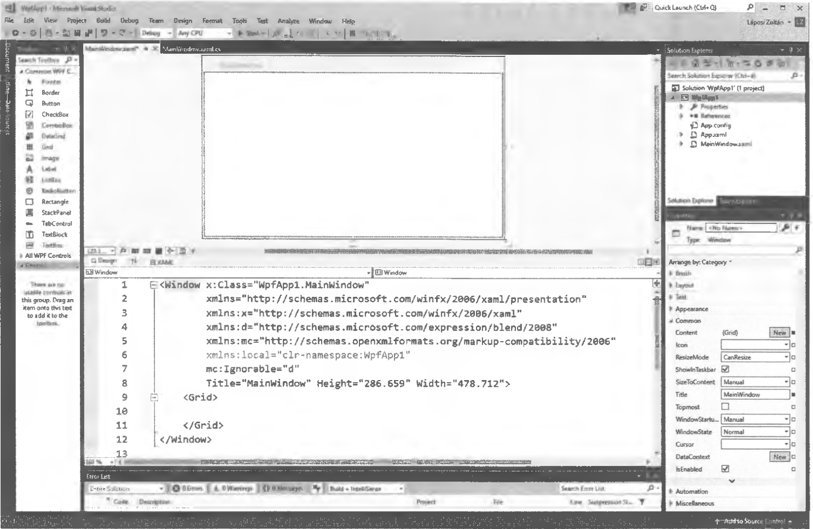

# 7.1. A WPF használata

Ha WPF-t szeretnénk használni, akkor a `New Project` után a `WPF App (.NET Framework)` segítségével megadjuk a Project nevét és kiválasztjuk a helyet. Ekkor az előttünk megjelenő képernyő úgy, vagy ahhoz nagyon hasonlóan néz ki, mint a következő ábrán.



A Windows Form és WPF ablak része nem igazán tér el első ránézésre. Ami újdonság, az a középen alul megjelenő rész, amely a HTML-re emlékezteti azokat, akik már foglalkoztak weblapkészítéssel.

Mint láthatjuk, itt a felül megjelenő ablak tulajdonságai, többek között a mérete jelenik meg. Ezek a tulajdonságok a Formnál is megtalálhatók, de itt azonnal látható. A `ToolBox`, a `Solution Explorer` és az `Error List` sem tér el jelentősen a Windows Formnál megszokottól. A `Properties` viszont már csak „nyomokban” emlékeztet a Form ugyanezen részére, mivel jónéhány tulajdonságot megtalálunk itt is, de több olyan is van, amely csak a WPF-re jellemző.

A különböző vezérlőelemeknél eltérő, hogy milyen tulajdonságok módosíthatók a Formokhoz hasonlóan és melyek térnek el, illetve bővült is a lehetőségek sora.

Csak az érdekesség kedvéért WPF-ben nagyon egyszerű a különböző vezérlőelemek elforgatása a `Properties -> Transform -> Rotate` segítségével, ahol a szöget adhatjuk meg. Ugyanitt a `Rotate` melletti `Scale` az x és y irányú átméretezést teszi lehetővé egyszerű módon.

Megemlítendő, hogy a Formoknál megszokott módtól eltérően itt nem lesz automatikusan ellátva névvel az adott elem. Nekünk kell nevet adni mindennek, ha ez a programozáshoz szükséges.

A `Properties` könnyebb használata miatt néhány fontosabb tulajdonság beállítását soroljuk fel az alábbiakban a teljesség igénye nélkül:

*   **Brush:** a vezérlőelemek háttér- és betűszíne módosítható.
*   **Layout:** a szélesség, magasság, az igazítás és a margók beállítása.
*   **Text:** betűtípus és méret, valamint stílus. Pl: félkövér.
*   **Appearance:** átlátszóság, láthatóság, keretek.
*   **Common:** a leggyakrabban használt tulajdonság a `Content`, amellyel a tartalom módosítható.
*   **Transform:** a korábban említetten kívül az eltolás és döntés is könnyen módosítható.

A `Layout` komponens használata a különböző vezérlőelemek esetén nagyon hasonlít a Word-ben található elrendezési lehetőségekhez. A fent említett tulajdonságok beállítása pedig a HTML-ben használt módon történik.

Például egy téglalap beállítása az alábbi módon történhet a `Layout` komponens segítségével:

```xml
<Rectangle x:Name="nev" Height="200" Width="100" HorizontalAlignment="Center" VerticalAlignment="Center" Margin="0,0,0,0"></Rectangle>
```

A téglalap neve után megadjuk a magasságot, a szélességet, vízszintes és függőleges igazítás és a margók értékeit.

A Windows Formok ismerete után a programozás tekintetében nagyon sok hasonlóságot fogunk tapasztalni, de természetesen bonyolultabb programoknál jelentős eltérés is lehet a Form és a WPF között.