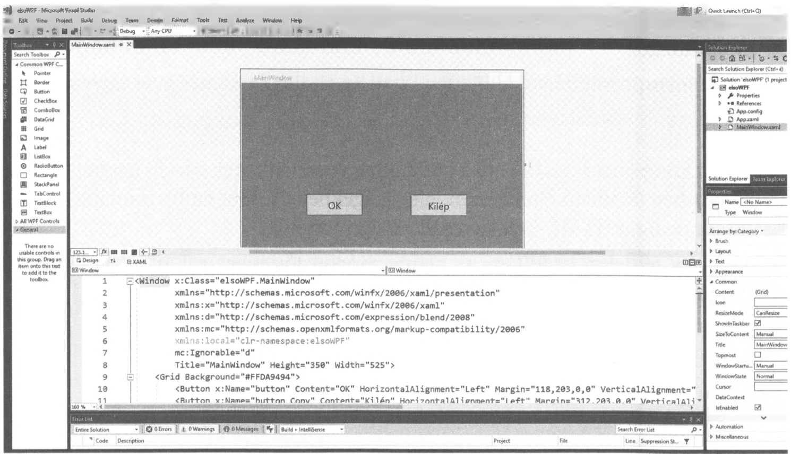

# 7.2. A Button

A `Button` használata itt is egyszerű. Nézzük meg egy konkrét példán keresztül.

!!! example "62. feladat"
    Készítsünk alkalmazást, amely gombra kattintva kiírja: Első WPF-es programom. Egy másik gombra kattintva pedig kilép!
    Név: WPF1

**Megoldás:**



A Windows Formhoz hasonlóan itt is az adott gombra kettőt kattintva megjelenik a gomb `Click` eseménye esetén lefutó alprogram kódja, ahová be kell írni az alábbi kódot:
```csharp
label.Content = "Első WPF-es programom";
```

Ez viszont csak akkor fog működni, ha előtte létrehoztunk egy címkét (`Label`-t), amelynek a hátterét ugyanolyanra állítjuk, mint az ablakét, így nem látszik a helye és a tartalma. Utóbbi csak akkor (jelenik meg), ha az OK gombra kattintunk.

A Kilép-re kattintva kettőt, írjuk be a Formoknál már megismert `this.Close();` utasítást.

Láthatjuk, hogy ami a Formnál a `label.Text`, az a WPF-ben a `label.Content`.

Természetesen módosíthatjuk tetszés szerint a `MainWindow.xaml` alatti `Window` részben az ablak, vagy a vezérlőelemek méreteit. A `Margin`, a `Width`, a `Height`, vagy a `FontSize` utáni értékek módosítása után megfigyelhetjük a változásokat.

```xml
<Button x:Name="button" Content="OK" 
        HorizontalAlignment="Left" Margin="118,203,0,0" 
        VerticalAlignment="Top" Width="104" Height="39" 
        FontSize="18" Click="buttonClick" />
```