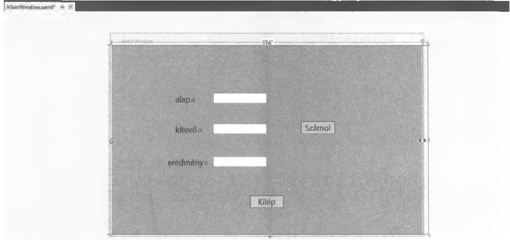
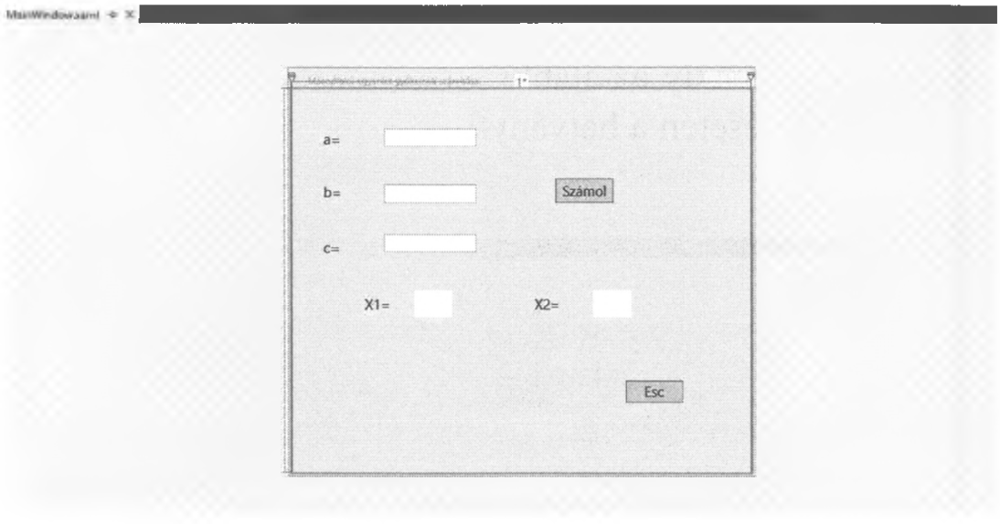

# 7.3. A TextBox

A `TextBox` használata sem fog sok újdonsággal szolgálni. Fontos lesz azonban az elnevezésekre odafigyelni, amit a `Properties` `Name` részben tehetünk meg, mivel a program során ezeket használni fogjuk.

!!! example "63. feladat"
    Készítsünk alkalmazást, amely az alábbi forma szerint épül fel és kiszámolja egy alap és kitevő megadása esetén a hatványt!
    Név: WPF2

**Megoldás:**



```csharp
private void button_Click(object sender, RoutedEventArgs e) 
{
    double alap = Convert.ToDouble(alapString.Text); 
    double kitevo = Convert.ToDouble(kitevoString.Text); 
    double eredmeny = Math.Pow(alap, kitevo); 
    eredmenyString.Text = eredmeny.ToString();
}
```

A fenti kódsorokat beírva – a Kiléphez a `this.Close();` -t elhelyezve – a kívánt működést kapjuk.
Láthatjuk, hogy a változódeklaráció, a konvertálás és a `TextBox`-ra történő hivatkozás is a megszokott módon történik. Itt azonban a szövegdoboz tartalmára való hivatkozást továbbra is a `Text` valósítja meg és nem `Content`, mint a `Button`, vagy a `Label` esetén.

!!! example "64. feladat"
    Készítsünk alkalmazást, amely alábbi forma szerint épül fel és kiszámolja, majd kiírja a másodfokú egyenlet együtthatóinak ismeretében a gyököket!
    Név: WPF3

**Megoldás:**



```csharp
private void button_Click(object sender, RoutedEventArgs e)
{
    double x1 = 0, x2 = 0, a = 0, b = 0, c = 0, d = 0;
    string szoveg = "";
    
    a = Convert.ToDouble(aString.Text);
    b = Convert.ToDouble(bString.Text);
    c = Convert.ToDouble(cString.Text);
    d = b * b - 4 * a * c;
    
    if (d >= 0)
    {
        x1 = (-b + Math.Sqrt(d)) / (2 * a);
        x1 = Math.Round(x1 * 100) / 100;
        
        x2 = (-b - Math.Sqrt(d)) / (2 * a);
        x2 = Math.Round(x2 * 100) / 100;
        
        szoveg = x1.ToString();
        x1String.Content = szoveg;
        
        szoveg = x2.ToString();
        x2String.Content = szoveg;
    }
    else
    {
        nincsGyokString.Visibility = Visibility.Visible;
    }
}
```

A Formnál már látott kódsort változtatás nélkül be lehet másolni és már működik is a WPF-es program. De hogy mégse legyen ugyanaz a megoldás, itt a gyökök nem létezése esetén a `nincsGyokString` labelünknek nem az értékét változtatjuk meg, mint a Formnál, hanem a láthatóságát.

```xml
<Label x:Name="nincsGyokString" Visibility="Hidden" Grid.ColumnSpan="3" 
       Content="Nincs gyök" HorizontalAlignment="Left" Margin="119,366,0,0" 
       VerticalAlignment="Top"/>
```

A fenti kódrészletben látható, hogy a címke tartalma kezdettől fogva a `Content` utáni rész lesz, de a láthatósága tiltva van. Ezt megtehetjük a `Properties` - `Appearance` - `Visibility` `Hidden`-re állításával, de a programban is megvalósíthattuk volna így:

```csharp
public MainWindow()
{
    InitializeComponent();
    nincsGyokString.Visibility = Visibility.Hidden;
}
```