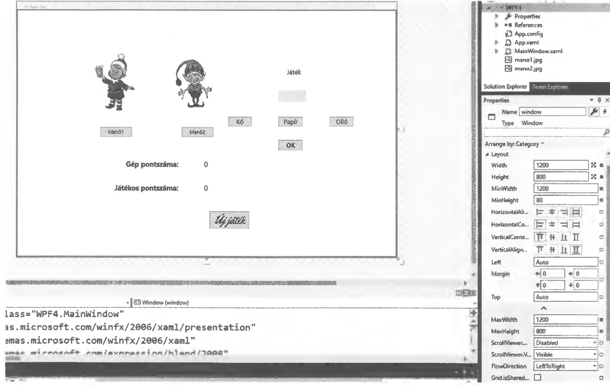

# 7.4. Az Image

Az `Image` használata lehet egyszerű, de bonyolult is, attól függően, hogy mit szeretnénk megvalósítani a program futása során. Képet több módon is elhelyezhetünk az ablakba, vagy akár gomb, esetleg más vezérlőelem háttereként. Ha gomb hátterébe helyezzük el, akkor a `Solution Explorer` részben célszerű egy (pl.: `image`) könyvtárt létrehozni és az abban elhelyezett képeket erőforrásként hozzáadni a programhoz, így a kép megjelenik a gomb hátterében, de ha az egeret fölé visszük, akkor sajnos a kép eltűnik. Ez kezdő programozóknak problémát jelent, mivel az alapbeállítást kell megváltoztatni a gomb viselkedését illetően, ami nem egyszerű feladat.

Nézzünk most egy egyszerű, de közismert játék megvalósítását WPF-ben.

!!! example "65. feladat"
    Készítsünk alkalmazást, amellyel a kő, papír, olló játékot lehet játszani a számítógép ellen!
    Tegyük fel, hogy többen is szeretik ezt a játékot egy családban és mindig annak a képe jelenik meg, aki éppen játszik. Az egyszerűség kedvéért legyen két felhasználó, de természetesen a program könnyen bővíthető, több felhasználó is használhatja a programot.
    A képek alatti gombra kattintva eltűnik az éppen nem játszó felhasználók képe és megjelennek a játékhoz szükséges vezérlőelemek. Ehhez az alábbi elrendezést célszerű kialakítani.
    Név: WPF4

**Megoldás:**

A XAML rész:

```xml
<Window x:Name="window1" x:Class="WPF4.MainWindow"
        xmlns="http://schemas.microsoft.com/winfx/2006/xaml/presentation"
        xmlns:x="http://schemas.microsoft.com/winfx/2006/xaml"
        xmlns:d="http://schemas.microsoft.com/expression/blend/2008"
        xmlns:mc="http://schemas.openxmlformats.org/markup-compatibility/2006"
        xmlns:local="clr-namespace:WPF4"
        mc:Ignorable="d"
        Title="Kő Papír Olló" Height="800" Width="1200"
        MaxWidth="1200" MaxHeight="800" MinWidth="1200" MinHeight="800"> 
    <Grid>
        <Button x:Name="mano1Button" Content="Manó1" HorizontalAlignment="Left" Margin="259,367,0,0" VerticalAlignment="Top" Width="100" Click="Button_Click" RenderTransformOrigin="2.565,3.979" Height="30" FontSize="16"/>
        <Button x:Name="mano2Button" Content="Manó2" HorizontalAlignment="Left" Margin="516,367,0,0" VerticalAlignment="Top" Width="100" Click="mano2Button_Click" RenderTransformOrigin="1.344,2.844" Height="30" FontSize="16"/>
        
        <Image x:Name="mano1" HorizontalAlignment="Center" Margin="79,67,654,388" Source="mano1.jpg" Stretch="Fill" MinWidth="192" MinHeight="192" VerticalAlignment="Center" MaxWidth="192" MaxHeight="192" ScrollViewer.VerticalScrollBarVisibility="Auto" StretchDirection="DownOnly" ScrollViewer.HorizontalScrollBarVisibility="Auto"> 
            <Image.RenderTransform>
                <TransformGroup>
                    <ScaleTransform />
                    <SkewTransform/>
                    <RotateTransform Angle="0"/> 
                    <TranslateTransform />
                </TransformGroup>
            </Image.RenderTransform>
        </Image>
        
        <Image x:Name="mano2" Margin="355,67,439,375" Source="mano2.jpg" Stretch="Fill" HorizontalAlignment="Center" MaxWidth="124" MaxHeight="205" VerticalAlignment="Center" ScrollViewer.HorizontalScrollBarVisibility="Auto" ScrollViewer.VerticalScrollBarVisibility="Auto" MinWidth="124" MinHeight="205"/>
        
        <Label x:Name="jatek" Content="Játék" HorizontalAlignment="Left" Margin="844,174,0,0" VerticalAlignment="Top" FontSize="20" RenderTransformOrigin="2.253,2.589"/>
        <Label x:Name="gep" Content=" " HorizontalAlignment="Left" Margin="823,250,0,0" VerticalAlignment="Top" RenderTransformOrigin="0.028,0.194" Background="#FFFlE6CD" FontSize="20"/>
        
        <Button x:Name="buttonKo" Content="Kő" HorizontalAlignment="Left" Margin="663,333,0,0" VerticalAlignment="Top" Width="75" FontSize="20" Click="buttonKo_Click" RenderTransformOrigin="2.155,3.428"/>
        <Button x:Name="buttonPapir" Content="Papír" HorizontalAlignment="Left" Margin="823,333,0,0" VerticalAlignment="Top" Width="75" FontSize="20" Click="buttonPapir_Click"/>
        <Button x:Name="buttonOllo" Content="Olló" HorizontalAlignment="Left" Margin="984,333,0,0" VerticalAlignment="Top" Width="75" FontSize="20" Click="buttonOllo_Click"/>
        <Button x:Name="ok" Content="OK" HorizontalAlignment="Left" Margin="823,406,0,0" VerticalAlignment="Top" Width="75" FontWeight="Bold" FontSize="20" Click="ok_Click"/>
        
        <Label x:Name="gepPontLabel" Content="Gép pontszáma: " HorizontalAlignment="Left" Margin="335,462,0,0" VerticalAlignment="Top" FontWeight="Bold" FontSize="22"/>
        <Label x:Name="jatekosPontLabel" Content="Játékos pontszáma:" HorizontalAlignment="Left" Margin="299,536,0,0" VerticalAlignment="Top" FontWeight="Bold" FontSize="22"/>
        
        <Label x:Name="gepPont" Content="0" HorizontalAlignment="Left" Margin="582,462,0,0" VerticalAlignment="Top" FontSize="22"/>
        <Label x:Name="jatekosPont" Content="0" HorizontalAlignment="Left" Margin="582,536,0,0" VerticalAlignment="Top" FontSize="22"/>
        
        <Button x:Name="ujJatek" Content="Új játék" HorizontalAlignment="Left" Margin="605,628,0,0" VerticalAlignment="Top" Width="125" FontFamily="Yellowtail" Height="55" FontSize="36" Click="ujJatek_Click" />
    </Grid> 
</Window>
```



A felhasználókat Manó1 és Manó2 néven láthatjuk a fenti ábrán. Az átméretezhetőség megakadályozása érdekében a `Properties` részben az 1200x800-as méreteket ajánlott beállítani alapként és ugyanezeket az értékeket a maximális és minimális méretekhez is.

A program kódja:

```csharp
using System;
using System.Collections.Generic;
using System.Linq;
using System.Text;
using System.Threading.Tasks;
using System.Windows;
using System.Windows.Controls;
using System.Windows.Data;
using System.Windows.Documents;
using System.Windows.Input;
using System.Windows.Media;
using System.Windows.Media.Imaging;
using System.Windows.Navigation;
using System.Windows.Shapes;

namespace WPF4
{
    /// <summary>
    /// Interaction logic for MainWindow.xaml 
    /// </summary>
    public partial class MainWindow : Window
    {
        public MainWindow()
        {
            InitializeComponent();
            jatek.Visibility = Visibility.Hidden; 
            gep.Visibility = Visibility.Hidden; 
            buttonKo.Visibility = Visibility.Hidden; 
            buttonPapir.Visibility = Visibility.Hidden; 
            buttonOllo.Visibility = Visibility.Hidden; 
            ok.Visibility = Visibility.Hidden; 
            gepPontLabel.Visibility = Visibility.Hidden; 
            jatekosPontLabel.Visibility = Visibility.Hidden; 
            gepPont.Visibility = Visibility.Hidden; 
            jatekosPont.Visibility = Visibility.Hidden; 
            ujJatek.Visibility = Visibility.Hidden;
        }

        private bool ko = false, papir = false, ollo = false;
        private int geppont = 0, emberpont = 0;

        private void buttonKo_Click(object sender, RoutedEventArgs e)
        {
            ko = true; 
            papir = false; 
            ollo = false;
            buttonKo.Background = Brushes.Red; 
            buttonKo.Content = "Kő"; 
            buttonPapir.Background = Brushes.Gray; 
            buttonOllo.Background = Brushes.Gray;
        }

        private void buttonPapir_Click(object sender, RoutedEventArgs e)
        {
            papir = true; 
            ko = false; 
            ollo = false;
            buttonPapir.Background = Brushes.Red; 
            buttonPapir.Content = "Papír"; 
            buttonKo.Background = Brushes.Gray; 
            buttonOllo.Background = Brushes.Gray;
        }

        private void buttonOllo_Click(object sender, RoutedEventArgs e)
        {
            ollo = true; 
            ko = false; 
            papir = false;
            buttonOllo.Background = Brushes.Red; 
            buttonOllo.Content = "Olló"; 
            buttonKo.Background = Brushes.Gray; 
            buttonPapir.Background = Brushes.Gray;
        }

        private void ujJatek_Click(object sender, RoutedEventArgs e)
        {
            geppont = 0; 
            emberpont = 0;
            gepPont.Content = Convert.ToString(geppont); 
            jatekosPont.Content = Convert.ToString(emberpont);
        }

        private void Button_Click(object sender, RoutedEventArgs e) // Manó 1 kiválasztása
        {
            mano2.Visibility = Visibility.Hidden; 
            mano2Button.Visibility = Visibility.Hidden; 
            jatek.Visibility = Visibility.Visible; 
            gep.Visibility = Visibility.Visible; 
            buttonKo.Visibility = Visibility.Visible; 
            buttonPapir.Visibility = Visibility.Visible; 
            buttonOllo.Visibility = Visibility.Visible; 
            ok.Visibility = Visibility.Visible; 
            gepPontLabel.Visibility = Visibility.Visible; 
            jatekosPontLabel.Visibility = Visibility.Visible; 
            gepPont.Visibility = Visibility.Visible; 
            jatekosPont.Visibility = Visibility.Visible; 
            ujJatek.Visibility = Visibility.Visible;
        }

        private void mano2Button_Click(object sender, RoutedEventArgs e) // Manó 2 kiválasztása
        {
            mano1.Visibility = Visibility.Hidden; 
            mano1Button.Visibility = Visibility.Hidden; 
            jatek.Visibility = Visibility.Visible; 
            gep.Visibility = Visibility.Visible; 
            buttonKo.Visibility = Visibility.Visible; 
            buttonPapir.Visibility = Visibility.Visible; 
            buttonOllo.Visibility = Visibility.Visible; 
            ok.Visibility = Visibility.Visible; 
            gepPontLabel.Visibility = Visibility.Visible; 
            jatekosPontLabel.Visibility = Visibility.Visible; 
            gepPont.Visibility = Visibility.Visible; 
            jatekosPont.Visibility = Visibility.Visible; 
            ujJatek.Visibility = Visibility.Visible;
        }

        private void ok_Click(object sender, RoutedEventArgs e)
        {
            Random vsz = new Random(); 
            int szam = vsz.Next(3); 
            
            if (szam == 0)
            {
                gep.Content = "Kő";
                if (papir == true) emberpont++;
                if (ollo == true) geppont++;
            }
            if (szam == 1)
            {
                gep.Content = "Papír"; 
                if (ko == true) geppont++; 
                if (ollo == true) emberpont++;
            }
            if (szam == 2)
            {
                gep.Content = "Olló"; 
                if (papir == true) geppont++; 
                if (ko == true) emberpont++;
            }
            
            gepPont.Content = Convert.ToString(geppont); 
            jatekosPont.Content = Convert.ToString(emberpont);
        }
    }
}
```

A láthatóság alapból a leírtaknak megfelelően van beállítva, és a Manó1, vagy Manó2 gombra kattintva változik meg.

A program lényegi része a véletlenszerűen előállított szám segítségével valósul meg, amely 3 értéket vehet fel:
*   0 - kő
*   1 - papír
*   2 - olló.

A játékos által kijelölt gomb és a gép által véletlenszerűen adott értékek eltérése a játék szabályainak megfelelően pontot ad a játékosnak, vagy a számítógépnek. Ha egyezik a két érték, akkor nem jár pont egyik félnek sem, mivel az `if` nem tartalmaz `else` részt sehol.

Megemlíthető még a `buttonOllo.Background = Brushes.Red;` kódrész, ahol a gomb hátterének változtatása látható a programon belül.

Látható, hogy néhány változó `private`-ként az alprogramokon kívül került elhelyezésre, mivel azokat több eseménynél is használni kell.

A képeket célszerű a programunk könyvtárában elhelyezni. A window részbe pedig egyszerűen másolás-beillesztés után a megfelelő méret beállításával fixen rögzíthetjük. Itt is ajánlott az alapértékek megtartása a maximális és minimális szélesség és magasság beállításánál.