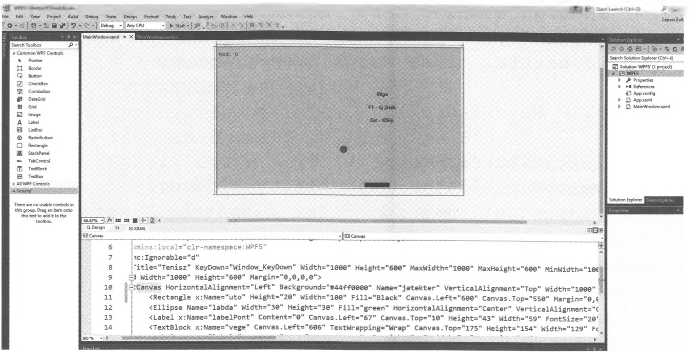

# 7.5. A Timer

WPF-ben is lehetőség van arra, hogy a program futása során eltelt időt figyeljük, lekérdezzük és az értéket szükség szerint felhasználjuk. Mindezt a következő példa megoldása során láthatjuk a gyakorlatban is.

!!! example "66. feladat"
    Készítsünk alkalmazást, amelyben egy mozgó labdát kell visszaütni egy vízszintesen mozgó ütő segítségével! Minden visszaütés 1 pontot ér a játékban és az ütőt egérmozgatással vezéreljük! A labda pattanjon vissza a játéktér határairól, kivéve alul! Az elért pontszámot írjuk ki a képernyőre!
    A visszaütés után a labda sebessége növekedjen, vagy ugyanannyi maradjon és az iránya is változzon kis mértékben! A játék végén jelenjen meg az újrakezdéshez és a kilépéshez szükséges információ! A játékból az Escape billentyűvel bármikor ki tudjon lépni a felhasználó!
    Név: WPF5

**Megoldás:**

A XAML rész:

```xml
<Window x:Class="WPF5.MainWindow"
        xmlns="http://schemas.microsoft.com/winfx/2006/xaml/presentation"
        xmlns:x="http://schemas.microsoft.com/winfx/2006/xaml"
        xmlns:d="http://schemas.microsoft.com/expression/blend/2008"
        xmlns:mc="http://schemas.openxmlformats.org/markup-compatibility/2006"
        xmlns:local="clr-namespace:WPF5"
        mc:Ignorable="d"
        Title="Tenisz" KeyDown="Window_KeyDown" Width="1000" Height="600" 
        MaxWidth="1000" MaxHeight="600" MinWidth="1000" MinHeight="600">
    <Grid Width="1000" Height="600" Margin="0,0,0,0"> 
        <Canvas HorizontalAlignment="Left" Background="#44ff0000" Name="jatekter"
                VerticalAlignment="Top" Width="1000" Height="600" 
                MinWidth="1000" MinHeight="600" MaxWidth="1000" MaxHeight="600" Margin="0,0,0,0">
            
            <Rectangle x:Name="uto" Height="20" Width="100" Fill="Black" Canvas.Left="600" Canvas.Top="550" Margin="0,0,0,0"></Rectangle>
            
            <Ellipse Name="labda" Width="30" Height="30" Fill="green" HorizontalAlignment="Center" VerticalAlignment="Center" Canvas.Left="500" Canvas.Top="400" />
            
            <Label x:Name="labelPont" Content="0" Canvas.Left="67" Canvas.Top="10" Height="43" Width="59" FontSize="20"/>
            
            <TextBlock x:Name="vege" Canvas.Left="606" TextWrapping="Wrap" Canvas.Top="175" Height="154" Width="129" FontSize="20" FontWeight="Bold" TextAlignment="Center">
                <Run Text="Vege"/><LineBreak/><Run/><LineBreak/><Run Text="F1 - uj jatek"/><LineBreak/><Run/><LineBreak/><Run Text="Esc - Kilep"/>
            </TextBlock>
            
            <Label x:Name="label1" Content="Pont:" Canvas.Top="10" Height="45" Width="58" FontSize="20"/>
        </Canvas>
    </Grid>
</Window>
```

A felületen 2 label van, amelyből az elsőnek nincs különösebb jelentősége, mivel a programban nem hivatkozunk rá, csak a tartalma fontos számunkra. („Pont”). A `labelPont` címke már lényeges lesz, csakúgy mint a `vege` TextBlock, amelyekre a programban hivatkozunk majd.

A labda egy `Ellipse`, az ütő pedig egy `Rectangle` segítségével jön létre. Célszerű a Canvas („vászon”) és a Grid („rács”) margó értékeit 0-ra, valamint a méreteket egyformára állítani. A játék könnyebb, ha az ütő szélesebb, és nehezebb, ha keskenyebb. Ha ennek érdekében az ütő szélességét módosítjuk, akkor a programban több helyen is módosítani kell az értékeket.



```csharp
if (XpositionUto > 885) XpositionUto = 885; 
if (Canvas.GetTop(labda) >= 520 && XpositionUto - 15 < Canvas.GetLeft(labda) && XpositionUto + 85 > Canvas.GetLeft(labda))
```
A `885` és a `85` változtatásával tehetjük meg ezt.

A program kódja:

```csharp
using System;
using System.Collections.Generic;
using System.Linq;
using System.Text;
using System.Threading.Tasks;
using System.Windows;
using System.Windows.Controls;
using System.Windows.Data;
using System.Windows.Documents;
using System.Windows.Input;
using System.Windows.Media;
using System.Windows.Media.Imaging;
using System.Windows.Navigation;
using System.Windows.Shapes;
using System.Windows.Threading;

namespace WPF5
{
    /// <summary> 
    /// Interaction logic for MainWindow.xaml 
    /// </summary>
    public partial class MainWindow : Window
    {
        public MainWindow()
        {
            InitializeComponent();
            vege.Visibility = Visibility.Hidden;
            
            DispatcherTimer ido = new DispatcherTimer();
            ido.Interval = TimeSpan.FromMilliseconds(1);
            ido.Tick += idoLepes;
            ido.Start();
        }

        private Random vsz = new Random();
        private int sebessegX = 1, sebessegY = 2, pont = 0, x = 200, y = 200;

        private void Window_KeyDown(object sender, KeyEventArgs e)
        {
            if (e.Key == Key.Escape) this.Close(); 
            if (e.Key == Key.F1)
            {
                sebessegX = 1;
                // .......
```