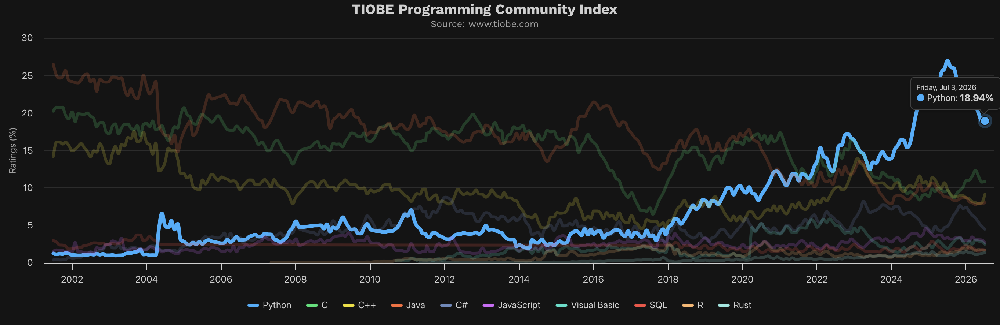

# 1. Bevezető

## 1.1. A Python nyelvről...

A Python népszerűsége az utóbbi években rendkívül dinamikusan növekszik. Ennek a kedveltségnek számos oka van, amelyek közül érdemes kiemelni a legfontosabbakat, hiszen egy olyan nyelvet kezdesz most tanulni, ami a világ technológiai élvonalába tartozik.

### Miért pont a Python?

*   **Egyszerű szintaxis (kódszerkezet):** Gyakran és joggal ajánlják első programozási nyelvnek. A Python nyelven írt forráskód rövid, tömör és kifejezetten könnyen olvasható. Szinte olyan, mintha egy letisztult angol nyelvű instrukciót olvasnál, mentes a más nyelvekre jellemző bonyolult zárójelezésektől és kötelező írásjelektől.
*   **Hatalmas és segítőkész közösség:** A rohamosan bővülő, óriási létszámú Python-közösség révén rengeteg ismertető, leírás, oktatóvideó és tipp található az interneten. Ez nagyban segíti az ismeretszerzést: ha elakadsz egy hibával, szinte biztos, hogy valaki már megoldotta azt előtted.
*   **Sokoldalúság és kiegészítő csomagok:** Jelentős számú "csomag" (könyvtár) készült a Pythonhoz. Ezeknek a használata óriási könnyebbséget jelent, és lehetővé teszi, hogy a nyelvet szinte bármire használd: játékfejlesztésre, weboldalak készítésére, vagy éppen a mindennapi, unalmas feladatok automatizálására.
*   **A jövő technológiái:** Olyan manapság igazán divatos, keresett és jól fizető területeken, mint a mesterséges intelligencia (AI), az adatbányászat vagy a gépi tanulás, a legtöbbször Python nyelven készülnek a programok. Ez az extrém mértékű ipari igény folyamatosan és garantáltan magasan tartja a nyelv népszerűségét.

### Hol tart a Python a világban?

A programozási nyelvek népszerűségét többféle módon is mérik. Az egyik legismertebb és legelismertebb rangsor az úgynevezett **TIOBE-index**, amely a keresőmotorok adatai és a szakemberek száma alapján rangsorol. Ennek alapján az utóbbi években a Python folyamatosan az élvonalban van, és stabilan meghódította az első helyet.

